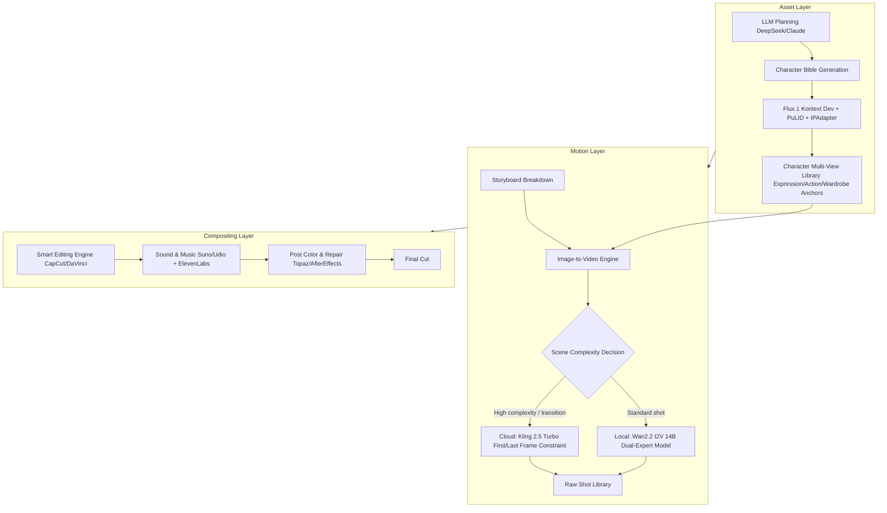

# AIGC Original Sci-Fi Micro-Short Drama "Singularity Echo"
# Complete Project Proposal

English (current) | [中文](./project_proposal.zh.md)

> Project codename: ShotFlow  
> Project nature: AIGC full-pipeline original micro-short drama / technical validation and workflow consolidation / reusable process template  
> Proposed cycle: 6 weeks (adjustable based on project scale)  
> Target final cut: 3–5 minutes, 4K, with complete sound design (example specs)  
> Written: 2025  
>
> **Note**: This proposal uses ShotFlow / "Singularity Echo" as an example to demonstrate the full industrial production pipeline of an AIGC micro-short drama. All script, character, shot, and sound design content is illustrative; replace it with your own project content in real use.

---

## I. Project Overview

### 1.1 Project Background

Most people doing AIGC video hit the same walls:

1. The same character changes face or clothing the moment the shot changes — character consistency is very hard to control.
2. The final cut always has an "AI plastic feel" — not enough refinement, a step short of cinematic quality.
3. Body and object motion frequently violates physical common sense; long shots are especially prone to breakdown.

Relying on a single prompt to direct-output, it is very hard to stably produce a watchable final cut. We want to break the whole pipeline into controllable nodes, lock in the working model combinations and parameters, and turn them into a reusable production line.

### 1.2 Project Goals

#### Technical Goals

- [ ] Run the **Flux.1 Kontext [dev] + IPAdapter** character-locking pipeline, with cross-shot character similarity > 95%.
- [ ] Run the **Wan2.2 I2V 14B High/Low Noise dual-expert** video generation pipeline, solving flicker and breakdown issues.
- [ ] Establish a cloud-local hybrid workflow; complex shots call Kling 2.5 Turbo with first/last frame constraints.

#### Artistic Goals

- [ ] Produce a 3–5 minute sci-fi micro-short drama that reaches "cinematic quality".
- [ ] Break the public stereotype that AI video has a "cheap feel".

#### Asset Goals

- [ ] Consolidate a standardized set of ComfyUI workflow JSONs.
- [ ] Build a character design library and a scene keyframe library.
- [ ] Output a detailed SOP operation manual to provide reference for subsequent mass production.

### 1.3 Project Scope

| Included | Not included |
|----------|--------------|
| Script, character bible, storyboard | Live-action shooting |
| AI image and video generation | Full traditional 3D CG pipeline (only used as auxiliary when necessary) |
| Voice-over, score, sound effects | Cinema-grade physical effects |
| Editing, color grading, 4K output | Long-form series or film production |
| Workflow packaging and tutorial release | Commercial distribution and copyright trading |

---

## II. Core Team

See [`07_Team/expert_team.md`](../../07_Team/expert_team.md) for details.

Core team roles include:

- Project mentor / instructor (external supervisor)
- Project producer / PM
- Technical director (senior developer)
- AI algorithm engineer
- AI art director
- Director / screenwriter
- Post-production director
- Sound designer / composer
- Quality director / QA
- Ops / deployment engineer

---

## III. Technical Architecture

This project splits the pipeline into three layers:

### 3.1 Key Tech Stack

| Layer | Component | Version / Model | Use |
|-------|-----------|-----------------|-----|
| Asset | DeepSeek / Claude | Latest API version | Script, character bible |
| Asset | Flux.1 Kontext [dev] | FP8/FP4 | Character consistency image generation |
| Asset | IPAdapter / PuLID | Latest version | Face / wardrobe anchor constraints |
| Motion | Wan2.2 I2V A14B | FP8 quantized | Standard shot video generation |
| Motion | Kling 2.5 Turbo | API | Complex shots / first-last frames |
| Compositing | CapCut Pro / DaVinci | Latest version | Editing and color grading |
| Compositing | Suno / Udio | Pro/Standard | Score |
| Compositing | ElevenLabs | Creator/Pro | Voice-over |
| Compositing | Topaz Video AI | Personal/Studio | Upscaling and denoising |
| Compositing | After Effects | 2024/2025 | Frame-by-frame repair |

---

## IV. Detailed Implementation Plan

### 4.1 Phase 1: Asset Forging and Technical Validation (Weeks 1–2)

| Task ID | Task | Owner | Deliverable | Acceptance Criteria | Status |
|---------|------|-------|-------------|---------------------|--------|
| S1-1 | Complete worldview and story outline | Director / Screenwriter | Story synopsis document | Clear core conflict, tellable in 3–5 minutes | [ ] |
| S1-2 | Write the complete script | Director / Screenwriter | Scene-by-scene script | Includes dialogue, action, scene descriptions | [ ] |
| S1-3 | Generate character design whitepaper | AI Art Director | Character bible document | Facial features, wardrobe anchors, personality keywords complete | [ ] |
| S1-4 | Design reference images for the female lead Ava | AI Art Director | Character reference set | Front/side/back three-view + expression/action anchors | [ ] |
| S1-5 | Deploy ComfyUI and required nodes | Technical Director | Runnable environment | Flux/Wan/IPAdapter nodes available | [ ] |
| S1-6 | Build Flux_Kontext_IPAdapter workflow | AI Algorithm Engineer | `Flux_Character_Consistency.json` | Same-character multi-image blind test passes | [ ] |
| S1-7 | Generate 24-shot keyframes (29 prompts incl. first/last frame splits) | AI Algorithm Engineer | Scene keyframe library | Covers ruins, ship interior and other core scenes | [ ] |
| S1-8 | Character consistency blind test | Director / Screenwriter | Blind test report | Team judges it as the same person | [ ] |

**End of week 2 milestone**: Character assets frozen, keyframe library passes review, instructor signs off.

### 4.2 Phase 2: Motion Shot Production (Weeks 3–4)

| Task ID | Task | Owner | Deliverable | Acceptance Criteria | Status |
|---------|------|-------|-------------|---------------------|--------|
| S2-1 | Deploy Wan2.2 I2V 14B dual-expert model | Technical Director | Local inference environment | High/Low Noise switchable | [ ] |
| S2-2 | Configure Kling 2.5 Turbo API | Technical Director | API key and call example | First/last frame feature available | [ ] |
| S2-3 | Break storyboard down into shot list | Director / Screenwriter | Storyboard table | Each shot tagged with complexity and generation method | [ ] |
| S2-4 | Standard shot generation | AI Algorithm Engineer | 17 Wan I2V + 2 Wan T2V clips | No obvious flicker/breakdown | [ ] |
| S2-5 | Complex shot generation | AI Algorithm Engineer | 5 Kling first/last frame shots | Motion trajectory matches first/last frame constraints | [ ] |
| S2-6 | CFG Scale and Denoise parameter tuning | AI Algorithm Engineer | Parameter record table | Balance between motion magnitude and stability | [ ] |
| S2-7 | Asset filtering and version management | Director / Screenwriter | Raw shot library | Naming convention, includes metadata | [ ] |

**End of week 4 milestone**: 24 raw video clips checked in, QA spot check passes.

### 4.3 Phase 3: Post-Production Compositing and Sound Design (Week 5)

| Task ID | Task | Owner | Deliverable | Acceptance Criteria | Status |
|---------|------|-------|-------------|---------------------|--------|
| S3-1 | Rough cut and pacing | Post-Production Director | Rough cut version | Smooth narrative, runtime as expected | [ ] |
| S3-2 | Lock the edit | Director / Post-Production Director | Locked edit timeline | No major structural changes | [ ] |
| S3-3 | ElevenLabs character voice-over | Sound Design | Dialogue track | Matches character personality | [ ] |
| S3-4 | Ambient sound effects and Foley | Sound Design | SFX asset library | Wind, machinery and other atmospheres complete | [ ] |
| S3-5 | Suno/Udio sci-fi score | Composer / Sound | Background music track | Emotion matches, doesn't overpower the scene | [ ] |
| S3-6 | Topaz Video AI upscaling and denoising | Post | 4K enhanced clips | Detail improved, noise controllable | [ ] |
| S3-7 | Defect repair | Post | Repaired clips | No visible visual bugs | [ ] |

**End of week 5 milestone**: Rough cut + sound effects version passes internal review.

### 4.4 Phase 4: Final Delivery and Workflow Packaging (Week 6)

| Task ID | Task | Owner | Deliverable | Acceptance Criteria | Status |
|---------|------|-------|-------------|---------------------|--------|
| S4-1 | DaVinci unified color grading | Post-Production Director | Color-graded final cut | Teal & Orange cinematic look, consistent tone | [ ] |
| S4-2 | Final mix and master output | Sound / Post | 4K final cut | A/V sync, format compliant | [ ] |
| S4-3 | Package ComfyUI workflow JSONs | Technical Director | Two workflow JSONs + dependency notes | Reproducible | [ ] |
| S4-4 | Write SOP operation manual | Technical Director | `sop_shotflow.pdf` | Covers the full pipeline | [ ] |
| S4-5 | Organize character asset library | AI Art Director | Training asset pack | Naming convention, includes licensing notes | [ ] |
| S4-6 | Multi-platform release and tech-community tutorial | Ops / Producer | Release links and tutorial docs | Final cut live, tutorial reproducible | [ ] |

**End of week 6 milestone**: Final cut released, project defense / showcase materials complete, instructor final sign-off.

---

## V. Resource Allocation and Budget

### 5.1 Hardware Configuration

| Hardware | Minimum | Recommended |
|----------|---------|-------------|
| GPU | RTX 4090 24GB | RTX 4090 ×2 or RTX 5090 |
| Memory | 64GB RAM | 128GB RAM |
| Storage | 2TB NVMe SSD | 4TB NVMe SSD |
| OS | Ubuntu 22.04 / Windows 11 | Ubuntu 22.04 LTS |

### 5.2 Software and Service Budget

| Item | Unit price | Period | Subtotal |
|------|-----------|--------|----------|
| Topaz Video AI Personal | $299/year | 1 year | ~¥2,100 |
| ElevenLabs Creator | $22/month | 1 month | ~¥160 |
| Suno Pro / Udio Standard | $10/month | 1 month | ~¥75 |
| Kling 2.5 Turbo (5 complex shots) | ~$0.21–0.28/5s | On demand | ~¥30–150 |
| Cloud GPU elastic scaling | $0.16–0.69/hr | 0–200 hours | ~¥0–1,000 |
| DaVinci Resolve Studio (optional) | $295 one-time | One-time | ~¥2,100 |

### 5.3 Total Budget Estimate

See [`06_Research/tech_stack_and_budget.md`](../../06_Research/tech_stack_and_budget.md) for details.

Total 6-week project budget (including hardware depreciation, software subscriptions, labor): **about ¥54,000–122,000**.

---

## VI. Risk Management

| Risk | Level | Mitigation | Owner |
|------|-------|-----------|-------|
| Character consistency loss of control | High | Wardrobe anchors + IPAdapter/PuLID + blind test + AE repair | Art / Algorithm |
| Physical logic breakdown | High | Multi-shot editing + Low Noise repair + Kling first/last frames + CG assist | Director / Post / Tech |
| Insufficient compute / slow generation | Medium | Cloud-local hybrid, FP8 quantization, parameter tuning, off-peak generation | Technical Director |
| Model licensing compliance | Medium | Upgrade Flux non-commercial license to commercial, Suno/ElevenLabs commercial plan | PM |
| Team member time conflicts | Medium | Daily standup, milestone sign-off, task buffer | PM |
| Asset loss | Low | NAS/cloud dual backup, Git LFS for JSON and reference images | Ops |

---

## VII. Quality Management

### 7.1 Quality Standards

| Dimension | Standard |
|-----------|----------|
| Character consistency | Passes cross-shot blind test, team judges as same person |
| Image quality | No obvious AI plastic feel, no severe flicker, model clipping, finger merging |
| Narrative fluency | Rough cut plays through without logical jumps |
| Audio quality | Clear dialogue, matching music mood, complete SFX layers |
| Technical reproducibility | Workflow JSON re-runs in an equivalent environment |

### 7.2 QA Checkpoints

- [ ] End of week 2: Character asset and keyframe review
- [ ] End of week 4: Raw shot quality spot check
- [ ] End of week 5: Rough cut + sound effects review
- [ ] End of week 6: Final cut and asset archive acceptance

---

## VIII. Communication and Reporting Mechanism

| Meeting | Frequency | Participants | Purpose |
|---------|-----------|--------------|---------|
| Instructor-team sync | Weekly | All members + instructor | Milestone report, gather feedback |
| Tech standup | Daily 15 min | Tech / Algorithm / Ops | Blocker sync |
| Creative review | Twice weekly | Director / Art / Post / Sound | Keyframe, shot, rough cut review |
| QA acceptance | Once per phase | QA + instructor + PM | Phase deliverable sign-off |

---

## IX. Deliverables Checklist

### 9.1 Final Film

- [ ] One 3–5 minute "Singularity Echo" micro-short drama (4K, with complete sound design)

### 9.2 Technical Assets

- [ ] `Flux_Character_Consistency.json`
- [ ] `Wan22_Dual_Expert_Video.json`
- [ ] Deployment scripts and environment configuration docs
- [ ] Parameter tuning record table

### 9.3 Documentation Assets

- [ ] Complete SOP operation manual (PDF)
- [ ] Character asset library (Ava, etc.)
- [ ] Storyboard and keyframe library
- [ ] Project summary report
- [ ] Tech community tutorial

---

## X. Project Success Criteria

1. The final cut reaches 4K resolution, runtime 3–5 minutes.
2. Cross-shot character consistency passes team blind test.
3. Workflow JSON and SOP can be reproduced by a third party.
4. The instructor/mentor signs off on all four phase milestones.
5. The final cut is successfully released on at least one public platform.

---

> This proposal is continuously updated as the project progresses. The latest version is this file (project_proposal.md).
