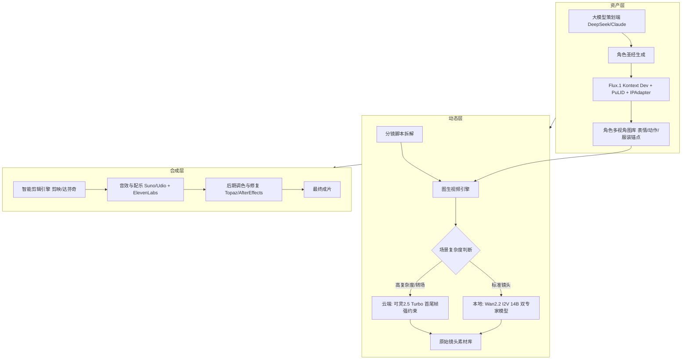

# AIGC 原创科幻微短剧《奇点回响》
# 完整项目计划书

[English](./project_proposal.md) | 中文（当前）

> 项目代号：ShotFlow  
> 项目性质：AIGC 全流程原创微短剧 / 技术验证与工作流沉淀 / 可复用流程模板  
> 拟定周期：6 周（可按项目规模调整）  
> 目标成片：3–5 分钟，4K，含完整音效（示例规格）  
> 撰写日期：2025 年
>
> **说明**：本计划书以 ShotFlow /《奇点回响》为例，演示 AIGC 微短剧工业化生产全流程。所有剧本、角色、镜头、音效等具体内容均为示例，实际应用时请按你的项目替换。

---

## 一、项目概述

### 1.1 项目背景

做 AIGC 视频的人大多撞过这几堵墙：

1. 同一人物换个镜头就变脸、变衣服，角色一致性很难压住。
2. 成片总带股“AI 塑料感”，细腻度不够，离电影质感差一截。
3. 肢体和物体运动经常违反物理常识，长镜头尤其容易崩坏。

光靠一句提示词直出，很难稳定做出能看的成片。我们想把整个流程拆成可控的节点，把调通的模型组合和参数固化下来，做成一套能反复用的流水线。

### 1.2 项目目标

#### 技术目标

- [ ] 跑通 **Flux.1 Kontext [dev] + IPAdapter** 角色锁定管线，跨镜头人物相似度 > 95%。
- [ ] 跑通 **Wan2.2 I2V 14B High/Low Noise 双专家** 视频生成管线，解决画面闪烁与崩坏问题。
- [ ] 建立云端-本地混合工作流，复杂镜头调用可灵 2.5 Turbo 首尾帧约束。

#### 艺术目标

- [ ] 输出一部时长 3–5 分钟、达到“电影级质感”的科幻微短剧。
- [ ] 打破大众对 AI 视频“廉价感”的刻板印象。

#### 资产目标

- [ ] 沉淀一套标准化 ComfyUI 工作流 JSON。
- [ ] 建立角色设定库与场景关键帧库。
- [ ] 输出详细 SOP 操作手册，给后续量产提供参考。

### 1.3 项目范围

| 包含 | 不包含 |
|------|--------|
| 剧本、角色圣经、分镜 | 真人演员拍摄 |
| AI 图像与视频生成 | 传统 3D CG 全流程（仅必要时辅助） |
| 配音、配乐、音效 | 院线级物理特效 |
| 剪辑、调色、4K 输出 | 长剧集或电影制作 |
| 工作流封装与教程发布 | 商业发行与版权交易 |

---

## 二、核心团队

详见 [`07_Team/expert_team.md`](../../07_Team/expert_team.md)。

团队核心角色包括：

- 项目导师/教师（外部督导）
- 项目制片人/PM
- 技术总监（资深开发者）
- AI 算法工程师
- AI 美术指导
- 导演/编剧
- 后期总监
- 声音设计师/作曲
- 质量总监/QA
- 运维/部署工程师

---

## 三、技术架构

本项目把流程分成三层：

### 3.1 关键技术栈

| 层级 | 组件 | 版本/型号 | 用途 |
|------|------|-----------|------|
| 资产 | DeepSeek / Claude | 当前 API 最新版 | 剧本、角色圣经 |
| 资产 | Flux.1 Kontext [dev] | FP8/FP4 | 角色一致性出图 |
| 资产 | IPAdapter / PuLID | 最新版 | 面部/服装锚点约束 |
| 动态 | Wan2.2 I2V A14B | FP8 量化 | 标准镜头视频生成 |
| 动态 | 可灵 2.5 Turbo | API | 复杂镜头/首尾帧 |
| 合成 | 剪映专业版 / 达芬奇 | 最新版 | 剪辑与调色 |
| 合成 | Suno / Udio | Pro/Standard | 配乐 |
| 合成 | ElevenLabs | Creator/Pro | 配音 |
| 合成 | Topaz Video AI | Personal/Studio | 超分与降噪 |
| 合成 | After Effects | 2024/2025 | 逐帧修复 |

---

## 四、详细实施计划

### 4.1 第一阶段：资产铸造与技术验证（第 1–2 周）

| 任务 ID | 任务内容 | 负责人 | 交付物 | 验收标准 | 状态 |
|---------|----------|--------|--------|----------|------|
| S1-1 | 完成世界观与故事大纲 | 导演/编剧 | 故事梗概文档 | 核心冲突清晰，3–5 分钟可讲完 | [ ] |
| S1-2 | 撰写完整剧本 | 导演/编剧 | 分场景剧本 | 含对白、动作、场景描述 | [ ] |
| S1-3 | 生成角色设计白皮书 | AI 美术指导 | 角色圣经文档 | 面部特征、服装锚点、性格关键词完整 | [ ] |
| S1-4 | 设计女主角艾娃参考图 | AI 美术指导 | 角色参考图集 | 正/侧/背三视图 + 表情/动作锚点 | [ ] |
| S1-5 | 部署 ComfyUI 与必要节点 | 技术总监 | 可运行环境 | Flux/Wan/IPAdapter 节点可用 | [ ] |
| S1-6 | 搭建 Flux_Kontext_IPAdapter 工作流 | AI 算法工程师 | `Flux_Character_Consistency.json` | 同角色多图盲测通过 | [ ] |
| S1-7 | 生成 24 镜头关键帧（含首尾帧拆分共 29 张提示词） | AI 算法工程师 | 场景关键帧图库 | 覆盖废墟、飞船内部等核心场景 | [ ] |
| S1-8 | 角色一致性盲测 | 导演/编剧 | 盲测报告 | 团队判定为同一人 | [ ] |

**第 2 周末里程碑**：角色资产冻结，关键帧库通过评审，教师签字确认。

### 4.2 第二阶段：动态镜头生产（第 3–4 周）

| 任务 ID | 任务内容 | 负责人 | 交付物 | 验收标准 | 状态 |
|---------|----------|--------|--------|----------|------|
| S2-1 | 部署 Wan2.2 I2V 14B 双专家模型 | 技术总监 | 本地可推理环境 | High/Low Noise 可切换 | [ ] |
| S2-2 | 配置可灵 2.5 Turbo API | 技术总监 | API 密钥与调用示例 | 首尾帧功能可用 | [ ] |
| S2-3 | 分镜脚本拆解为镜头清单 | 导演/编剧 | 分镜表 | 每个镜头标注复杂度与生成方式 | [ ] |
| S2-4 | 标准镜头生成 | AI 算法工程师 | 17 个 Wan I2V + 2 个 Wan T2V 片段 | 无明显闪烁/崩坏 | [ ] |
| S2-5 | 复杂镜头生成 | AI 算法工程师 | 5 个可灵首尾帧镜头 | 运动轨迹符合首尾帧约束 | [ ] |
| S2-6 | CFG Scale 与 Denoise 参数调优 | AI 算法工程师 | 参数记录表 | 运动幅度与稳定性平衡 | [ ] |
| S2-7 | 素材筛选与版本管理 | 导演/编剧 | 原始镜头素材库 | 命名规范，含元数据 | [ ] |

**第 4 周末里程碑**：24 个原始视频片段入库，QA 抽检通过。

### 4.3 第三阶段：后期合成与音效设计（第 5 周）

| 任务 ID | 任务内容 | 负责人 | 交付物 | 验收标准 | 状态 |
|---------|----------|--------|--------|----------|------|
| S3-1 | 粗剪与节奏调整 | 后期总监 | 粗剪版本 | 叙事流畅，时长符合预期 | [ ] |
| S3-2 | 锁定剪辑版本 | 导演/后期总监 | 锁定剪辑时间线 | 无重大结构改动 | [ ] |
| S3-3 | ElevenLabs 角色配音 | 声音设计 | 对白音轨 | 符合角色性格 | [ ] |
| S3-4 | 环境音效与 Foley | 声音设计 | 音效素材库 | 风声、机械声等氛围完整 | [ ] |
| S3-5 | Suno/Udio 科幻配乐 | 作曲/声音 | 背景音乐轨 | 情绪匹配，不抢戏 | [ ] |
| S3-6 | Topaz Video AI 超分与降噪 | 后期 | 4K 增强片段 | 细节提升，噪声可控 | [ ] |
| S3-7 | 瑕疵修复 | 后期 | 修复后片段 | 视觉无明显 BUG | [ ] |

**第 5 周末里程碑**：粗剪+音效版本通过内部审看。

### 4.4 第四阶段：成片发布与工作流封装（第 6 周）

| 任务 ID | 任务内容 | 负责人 | 交付物 | 验收标准 | 状态 |
|---------|----------|--------|--------|----------|------|
| S4-1 | 达芬奇统一调色 | 后期总监 | 调色后成片 | Teal & Orange 电影感，影调统一 | [ ] |
| S4-2 | 最终混音与母版输出 | 声音/后期 | 4K 最终成片 | 音视频同步，格式合规 | [ ] |
| S4-3 | 打包 ComfyUI 工作流 JSON | 技术总监 | 两个工作流 JSON + 依赖说明 | 可复现 | [ ] |
| S4-4 | 撰写 SOP 操作手册 | 技术总监 | `sop_shotflow.pdf` | 覆盖全流程 | [ ] |
| S4-5 | 整理角色资产库 | AI 美术指导 | 训练素材包 | 命名规范，含授权说明 | [ ] |
| S4-6 | 全平台发布与技术社区教程 | 运营/制片 | 发布链接与教程文档 | 正片上线，教程可复现 | [ ] |

**第 6 周末里程碑**：最终成片发布，项目答辩/展示材料完成，教师最终签字。

---

## 五、资源配置与预算

### 5.1 硬件配置

| 硬件 | 最低配置 | 推荐配置 |
|------|----------|----------|
| GPU | RTX 4090 24GB | RTX 4090 ×2 或 RTX 5090 |
| 内存 | 64GB RAM | 128GB RAM |
| 存储 | 2TB NVMe SSD | 4TB NVMe SSD |
| 系统 | Ubuntu 22.04 / Windows 11 | Ubuntu 22.04 LTS |

### 5.2 软件与服务预算

| 项目 | 单价 | 周期 | 小计 |
|------|------|------|------|
| Topaz Video AI Personal | $299/年 | 1 年 | ~¥2,100 |
| ElevenLabs Creator | $22/月 | 1 个月 | ~¥160 |
| Suno Pro / Udio Standard | $10/月 | 1 个月 | ~¥75 |
| 可灵 2.5 Turbo（5 个复杂镜头） | ~$0.21–0.28/5s | 按需 | ~¥30–150 |
| 云端 GPU 弹性扩容 | $0.16–0.69/hr | 0–200 小时 | ~¥0–1,000 |
| 达芬奇 Resolve Studio（可选） | $295 一次性 | 一次性 | ~¥2,100 |

### 5.3 总预算估算

详见 [`06_Research/tech_stack_and_budget.md`](../../06_Research/tech_stack_and_budget.md)。

6 周项目总预算（含硬件折旧、软件订阅、人力）：**约 ¥54,000–122,000**。

---

## 六、风险管理

| 风险 | 等级 | 应对措施 | 负责人 |
|------|------|----------|--------|
| 角色一致性失控 | 高 | 服装锚点 + IPAdapter/PuLID + 盲测 + AE 修补 | 美术/算法 |
| 物理逻辑崩坏 | 高 | 多镜头剪辑 + Low Noise 修复 + 可灵首尾帧 + CG 辅助 | 导演/后期/技术 |
| 算力不足/生成慢 | 中 | 云端-本地混合、FP8 量化、参数调优、错峰生成 | 技术总监 |
| 模型授权合规 | 中 | Flux 非商业授权升级为商业授权、Suno/ElevenLabs 商用计划 | PM |
| 团队成员时间冲突 | 中 | 每日站会、里程碑签字、任务缓冲期 | PM |
| 素材丢失 | 低 | NAS/云盘双备份、Git LFS 管理 JSON 与参考图 | 运维 |

---

## 七、质量管理

### 7.1 质量标准

| 维度 | 标准 |
|------|------|
| 角色一致性 | 跨镜头盲测通过，团队判定为同一人 |
| 画面质量 | 无明显 AI 塑料感、无严重闪烁、穿模、手指融合 |
| 叙事流畅 | 粗剪版本连续观看无逻辑跳跃 |
| 音频质量 | 对白清晰、配乐情绪匹配、音效层次完整 |
| 技术可复现 | 工作流 JSON 在同等环境下可重新跑通 |

### 7.2 QA 检查点

- [ ] 第 2 周末：角色资产与关键帧评审
- [ ] 第 4 周末：原始镜头质量抽检
- [ ] 第 5 周末：粗剪+音效审看
- [ ] 第 6 周末：最终成片与资产归档验收

---

## 八、沟通与汇报机制

| 会议 | 频率 | 参与者 | 目的 |
|------|------|--------|------|
| 师生同步会 | 每周 1 次 | 全体成员 + 教师 | 里程碑汇报、获取反馈 |
| 技术站会 | 每日 15 分钟 | 技术/算法/运维 | 阻塞同步 |
| 创意评审会 | 每周 2 次 | 导演/美术/后期/声音 | 关键帧、镜头、粗剪审看 |
| QA 验收会 | 每阶段 1 次 | QA + 教师 + PM | 阶段交付物签字 |

---

## 九、交付成果清单

### 9.1 正片作品

- [ ] 《奇点回响》3–5 分钟微短剧一部（4K，含完整音效）

### 9.2 技术资产

- [ ] `Flux_Character_Consistency.json`
- [ ] `Wan22_Dual_Expert_Video.json`
- [ ] 部署脚本与环境配置文档
- [ ] 参数调优记录表

### 9.3 文档资产

- [ ] 完整 SOP 操作手册（PDF）
- [ ] 角色资产库（艾娃等）
- [ ] 分镜脚本与关键帧库
- [ ] 项目总结报告
- [ ] 技术社区教程

---

## 十、项目成功标准

1. 最终成片达到 4K 分辨率，时长 3–5 分钟。
2. 跨镜头角色一致性通过团队盲测。
3. 工作流 JSON 与 SOP 可被第三方复现。
4. 教师/导师对四个阶段里程碑均签字确认。
5. 正片在至少一个公开平台成功发布。

---

> 本计划书随项目推进持续更新。最新版本以本文件（project_proposal.md）为准。
