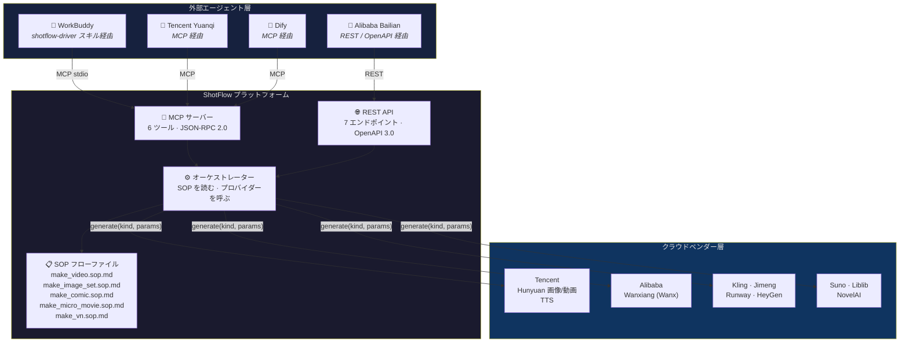
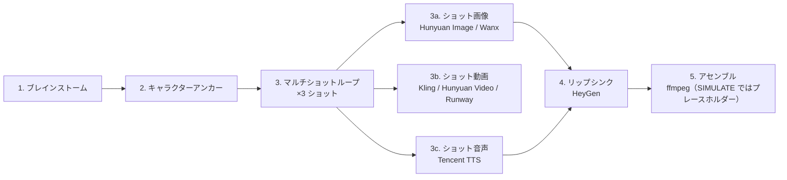
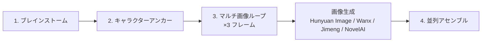
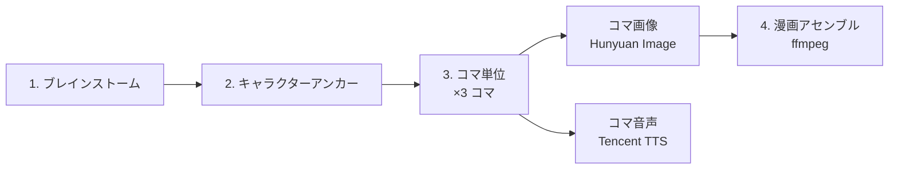
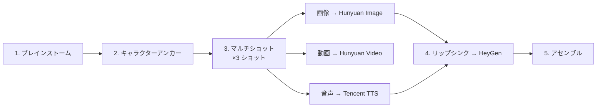
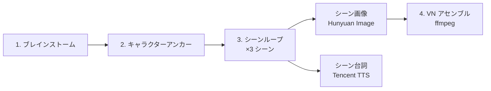

# ShotFlow

> フローファイル駆動型 AIGC オーケストレーションプラットフォーム。外部エージェントが SOP 定義を読み取り、ベンダーに依存しない生成ツールを呼び出します——ハードコードされた頭脳は不要、全工程が再現可能。

[](LICENSE)
[](https://www.python.org/downloads/)
[](https://github.com/psf/black)

[English](README.md) · [中文](README.zh-CN.md) · 日本語

---

## 目次

- [概要](#概要)
- [アーキテクチャ](#アーキテクチャ)
- [特徴](#特徴)
- [対応プロバイダー](#対応プロバイダー)
- [クイックスタート](#クイックスタート)
- [プロダクションワークフロー](#プロダクションワークフロー)
- [MCP ツールリファレンス](#mcp-ツールリファレンス)
- [エージェント連携](#エージェント連携)
- [プロジェクト構成](#プロジェクト構成)
- [よくある質問](#よくある質問)
- [コントリビューション](#コントリビューション)
- [ライセンス](#ライセンス)

---

## 概要

ShotFlow は **AIGC（AI 生成コンテンツ）オーケストレーションプラットフォーム**です。「何を」と「どうやって」を分離するというシンプルなアイデアに基づいています。

ShotFlow は生成ロジックを組み込まず、以下を提供します：

1. **SOP フローファイル** — 各出力タイプの完全な手順を定義した Markdown 文書。
2. **ベンダー非依存の生成ツール** — REST API と MCP プロトコルの両方で公開。あらゆるエージェントフレームワークが呼び出し可能。
3. **11 のクラウドベンダー連携** — Tencent Hunyuan から Runway、HeyGen、NovelAI まで、統一 `BaseProvider` インターフェースでカプセル化。

外部エージェント（WorkBuddy、Tencent Yuanqi、Alibaba Bailian、Dify など）が SOP フローファイルを読み取り、ツールを駆動します。ShotFlow は「頭脳」をハードコードせず、エージェントに必要なツールと指示を提供します。

---

## アーキテクチャ



---

## 特徴

### コアデザイン

- **フローファイル駆動**：各プロダクションパイプラインは SOP Markdown ファイルとして定義。SOP を変更すれば出力も変更され、コード修正は不要。
- **ハードコードされた頭脳なし**：ShotFlow はツールを提供し、判断は行いません。外部エージェントが SOP を読み取り、自律的にオーケストレーション。
- **SIMULATE モード**：GPU や API 資格情報なしでパイプライン全体を開発・テスト可能。全プロバイダーがプレースホルダーアセットを返却。

### プロバイダーサポート

- **11 のクラウドベンダー**を統一 `BaseProvider` ABC で統合。
- **MCP + REST 二重公開**：最大のエージェントフレームワーク互換性を実現。
- **拡張容易**：`generate(kind, params)` を実装し、`app/services/providers/__init__.py` に登録するだけ。

### 再現性

- 全生成ステップの完全な `Spec` レコードをデータベースに保存。パラメータ、プロバイダー、出力アセット参照を含む。
- 結果の再確認、比較、再実行が可能。
- プロジェクトに変更履歴とバージョン管理を内蔵。

### エージェントエコシステム対応

- **WorkBuddy スキル**：`shotflow-driver` が一文で動画生成を実現。
- **MCP マニフェスト**：`integration/shotflow.mcp.json` を任意の MCP クライアントに取り込めば、6 ツールを即座に検出。
- **OpenAPI 仕様**：`integration/openapi.json` をコード生成ツール（OpenAPI Generator、Postman 等）にインポート可能。

---

## 対応プロバイダー

| プロバイダー | タイプ | 状態 | 必要情報 |
|---|---|---|---|
| Hunyuan Image | 画像生成 | ✅ | SecretID / SecretKey |
| Hunyuan Video | 動画生成 | ✅ | SecretID / SecretKey |
| Tencent TTS | 音声合成 | ✅ | SecretID / SecretKey |
| Wanxiang / Wanx | 画像生成 | ✅ | API Key |
| Kling | 動画生成 | ✅ | API Key + Base URL |
| Jimeng | 画像生成 | ✅ | API Key + Base URL |
| Runway | 動画生成 | ✅ | API Key |
| HeyGen | リップシンク動画 | ✅ | API Key |
| Suno | 音楽生成 | ✅ | API Key |
| Liblib | 画像生成 | ✅ | API Key |
| NovelAI | 画像生成 | ✅ | API Key |

全プロバイダーが `SIMULATE_MODE=true` に対応。`.env` で設定すれば、キーなしでパイプライン全体をテスト可能。

---

## クイックスタート

### 前提条件

- Python 3.12+
- Node.js 22+（フロントエンド開発）
- （オプション）PostgreSQL（本番環境）

### 1. クローンとセットアップ

```bash
git clone https://github.com/weed33834/ShotFlow.git
cd ShotFlow

# バックエンド
python -m venv venv
# source venv/bin/activate  # Linux/macOS
# venv\Scripts\activate     # Windows
pip install -r backend/requirements.txt

# 環境変数
cp .env.example .env
# API キーがある場合は .env を編集；SIMULATE_MODE=true でそのまま動作
```

### 2. データベース初期化

```bash
PYTHONPATH=backend python backend/init_db.py
```

### 3. サーバー起動

```bash
# バックエンド API
PYTHONPATH=backend uvicorn app.main:app --reload --port 8000

# フロントエンド（別ターミナル）
cd frontend
npm install
npm run dev
```

### 4. 動画生成（SIMULATE モード）

```bash
curl -X POST http://localhost:8000/api/v1/generate \
  -H "Content-Type: application/json" \
  -d '{
    "nl_prompt": "A happy little egg-yolk creature laughing on grass",
    "output_type": "video"
  }'
```

このコマンドは `make_video.sop.md` ワークフローを SIMULATE モードで実行し、spec ID とプレースホルダーアセット URL を返します。

### 5. MCP サーバー確認

```bash
PYTHONPATH=backend python -m app.services.mcp_server
```

サーバーログに `FastMCP 3.4.4` と 6 ツール登録が表示され、stdio ベースのエージェント通信を待機します。

---

## プロダクションワークフロー

### 動画制作 (`flows/make_video.sop.md`)



### 画像セット (`flows/make_image_set.sop.md`)



### 漫画 / 動的漫画 (`flows/make_comic.sop.md`)



### マイクロムービー (`flows/make_micro_movie.sop.md`)



### ビジュアルノベル (`flows/make_vn.sop.md`)



---

## MCP ツールリファレンス

ShotFlow は 6 つのツールを MCP サーバー経由で公開します。

| ツール | 説明 | パラメーター |
|---|---|---|
| `consistency_anchor` | プロンプトから一貫性アンカー画像を生成 | `prompt: str` |
| `generate_image` | 指定プロバイダーで画像を生成 | `provider, prompt, size, ...` |
| `generate_video` | テキストまたは入力画像から動画を生成 | `provider, prompt, image?, seconds, ...` |
| `generate_audio` | テキストから音声を生成（TTS） | `provider, text, voice?` |
| `lip_sync` | 音声を動画の口の動きに同期 | `provider, video_url, audio_url` |
| `assemble` | アセットを最終出力に合成 | `shots: list[ShotAssets], output_type` |

### MCP トランスポート

サーバーはデフォルトで **stdio**（標準 MCP トランスポート）で待機します。ストリーミング HTTP トランスポートを使用する場合は、MCP クライアントを ShotFlow REST API 経由でプロキシするか、SSE ブリッジを使用してください。

---

## エージェント連携

ShotFlow は外部 AI エージェントに駆動されるよう設計されています。

### WorkBuddy（shotflow-driver スキル経由）

`shotflow-driver` スキルは `~/.workbuddy/skills/shotflow-driver/` にインストール済み。WorkBuddy に「ShotFlow で動画を生成して」と指示すると、フローファイルを読み取り、6 つの MCP ツールを順次呼び出します。

### 任意の MCP クライアント（Yuanqi、Dify 等）

1. `integration/shotflow.mcp.json` を MCP クライアント設定にコピー。
2. クライアントが 6 ツールを自動検出。
3. クライアントが SOP フローファイルを読み取り、ツール呼び出しをオーケストレーション。

### REST API（Bailian、カスタムエージェント）

- 完全な OpenAPI 3.0 仕様：`integration/openapi.json`
- ベース URL：`http://localhost:8000/api/v1`
- エンドポイント：`/generate`、`/anchor`、`/assemble`、`/spec`、`/tools/assets`

### Edge デプロイメント

レイテンシが重要なシナリオ（プレビューレンダリング、リアルタイム対話）では、MCP サーバーをエッジ関数にデプロイすることを検討してください：

- **Tencent EdgeOne Makers**：グローバル CDN 高速化を備えた Agent ネイティブホスティング。
- **Alibaba Function Compute**：ShotFlow ツールをステートレス関数としてデプロイし、機密計算（TDX）で資格情報を保護。

---

## プロジェクト構成

```
shotflow/
├── backend/
│   ├── app/
│   │   ├── api/v1/           # REST エンドポイント
│   │   ├── core/             # 設定、データベース
│   │   ├── models/           # SQLAlchemy モデル
│   │   ├── schemas/          # Pydantic スキーマ
│   │   └── services/
│   │       ├── providers/    # 11 ベンダー統合
│   │       ├── mcp_server.py # MCP ツール定義
│   │       ├── orchestrator.py
│   │       └── tools_service.py
│   ├── tests/
│   └── requirements.txt
├── frontend/
│   └── src/
│       ├── api/              # API クライアント
│       ├── layouts/          # レイアウト
│       ├── pages/            # Generate、Workflows、Assets
│       └── types/            # TypeScript 型定義
├── flows/                    # SOP フローファイル
├── integration/              # 公開パッケージ
├── .env.example
├── LICENSE
├── README.md
└── CHANGELOG.md
```

---

## よくある質問

**Q: ShotFlow は GPU が必要ですか？**
A: いいえ。すべての生成はクラウドベンダー API にオフロードされます。開発とテストでは、SIMULATE モードが GPU やキーなしでプレースホルダーアセットを返します。

**Q: 独自のプロバイダーを追加できますか？**
A: はい。`BaseProvider` を継承したクラスを作成し、`generate(kind, params)` を実装して `AssetResult` を返し、`app/services/providers/__init__.py` に登録してください。

**Q: REST API に認証はありますか？**
A: 組み込まれていません。本番環境ではリバースプロキシ（Nginx、Caddy）で認証層を追加してください。

---

## コントリビューション

コントリビューションを歓迎します。Pull Request を送る前に [CONTRIBUTING.md](CONTRIBUTING.md) と [Code of Conduct](CODE_OF_CONDUCT.md) をお読みください。

---

## ライセンス

ShotFlow は **MIT ライセンス**のもとでオープンソース公開されています。詳細は [LICENSE](LICENSE) をご覧ください。

---

*ShotFlow — SOP 駆動、エージェントネイティブな AIGC オーケストレーションプラットフォーム。*
