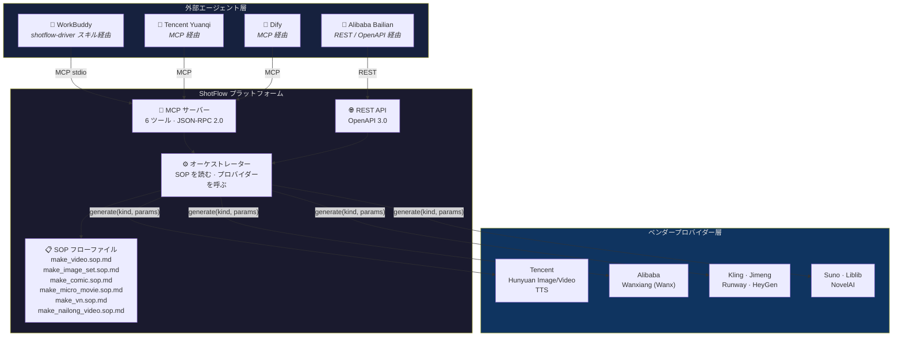
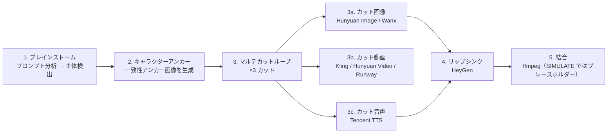
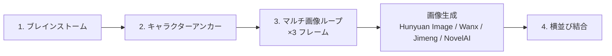
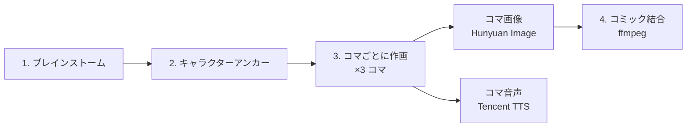
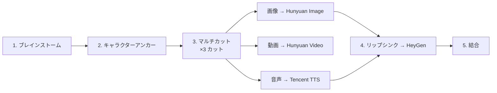
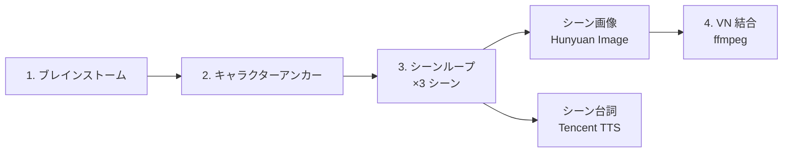

# ShotFlow

[English](README.md) | [中文](README.zh.md) | [日本語](README.ja.md)

> フローファイル駆動型 AIGC オーケストレーションプラットフォーム。外部エージェントが SOP 定義を読み取り、ベンダー非依存の生成ツールを呼び出します——ハードコードされた頭脳は持たず、全工程が再現可能。

[](https://github.com/weed33834/ShotFlow/actions/workflows/ci.yml)
[](LICENSE)
[](https://www.python.org/downloads/)
[](https://nodejs.org/)
[](https://github.com/psf/black)

**キーワード**: AI 動画生成、テキストから動画、AIGC、AI オーケストレーション、シネマティック AI、FFmpeg、MCP、FastAPI、React、edge-tts、Real-ESRGAN、RIFE、GPT-SoVITS、FunASR、ボイスクローン、テキスト読み上げ、AI 映像制作、自動動画制作

---

## 目次

- [ShotFlow とは](#shotflow-とは)
- [アーキテクチャ概要](#アーキテクチャ概要)
- [機能](#機能)
- [対応プロバイダー](#対応プロバイダー)
- [クイックスタート](#クイックスタート)
- [プロダクションワークフロー](#プロダクションワークフロー)
- [MCP ツールリファレンス](#mcp-ツールリファレンス)
- [エージェント連携](#エージェント連携)
- [プロジェクト構成](#プロジェクト構成)
- [よくある質問](#よくある質問)
- [コントリビューション](#コントリビューション)
- [ライセンス](#ライセンス)

---

## ShotFlow とは

ShotFlow は **AIGC（AI 生成コンテンツ）オーケストレーションプラットフォーム**で、*何を*作るかと*どう*作るかを分離するという原則に基づいています。

生成ロジックを単一のパイプラインに埋め込むのではなく、ShotFlow は三つのコンポーネントを提供します。

1. **SOP フローファイル**——各出力タイプ（動画、画像セット、コミック、ショート映画、ビジュアルノベル）の生産手順を順を追って定義した Markdown 文書。
2. **ベンダー非依存の生成ツール**——REST API と MCP（Model Context Protocol）の両方で公開。任意のエージェントフレームワークから呼び出し可能。
3. **13 のプロバイダー連携**——Tencent Hunyuan から Runway、HeyGen、NovelAI まで、統一 `BaseProvider` インターフェースでカプセル化。

外部エージェント（WorkBuddy、Tencent Yuanqi、Alibaba Bailian、Dify など）が SOP フローファイルを読み取り、ツールを駆動します。ShotFlow は「頭脳」をハードコードせず、エージェントに必要なツールと手順だけを提供します。

---

## アーキテクチャ概要



---

## 機能

### コア設計

- **フローファイル駆動**: 各プロダクションパイプラインは SOP Markdown ファイルとして定義されます。SOP を変えれば出力が変わります——コードの変更は不要。
- **ハードコードされた頭脳を持たない**: ShotFlow が提供するのはツールであり、意思決定ではありません。外部エージェントが SOP を読んで独自にオーケストレーションします。
- **SIMULATE モード**: GPU や API 認証情報なしで全パイプラインを開発・テスト可能。全プロバイダーがプレースホルダー資産を返します。

### シネマティックプロンプトシステム

- **13 のスタイルプリセット**: cinematic、cyberpunk、anime、ink_wash、ghibli、oil_painting、realistic、watercolor、documentary、wes_anderson、scifi、fantasy、noir——それぞれがプロ品質の画像/動画サフィックスとネガティブプロンプトを LLM のシステムプロンプトに注入します。
- **10 のシーンテンプレート**: product、food、travel、knowledge、story、city、nature、action、interview、tutorial——それぞれがカットリズム、カット順序、照明、トランジションスタイルを定義します。
- **シネマティックキーワードライブラリ**: 照明 15 種、カメラアングル 15 種、カメラワーク 15 種、ムード 15 種——LLM 未設定時にフォールバックプロンプトを補強するためにサンプリングされます。
- **品質レベル**: standard（1080p）、hd（1080p＋ボケ）、4k（4K HDR ACES）、8k（8K HDR Dolby Vision）——プロンプトに埋め込む技術パラメータを制御します。

### 高度な動画パイプライン（FFmpeg）

- **xfade トランジション**: 13 種のエフェクト（fade、wipeleft、circleopen、distance、zoomin、smoothup など）でセグメント間のクロスディゾルブを実現。
- **Ken Burns 効果**: 静止画像に zoompan フィルターを適用——方向を交互に切り替えながら緩やかにズームイン/アウトし、画面に変化を与えます。
- **カラーグレーディング**: 5 つのプリセット（vintage、cross_process、teal_orange、high_contrast、warm_film）を FFmpeg の `curves` + `eq` フィルターで実装。
- **60 秒以上の長尺動画**: offset 計算を伴う xfade チェーンがセグメント数を問わず、一貫した長尺作品を出力します。

### オープンソース AI 代替手段

オープンソースツールはすべて gracefully degrade します——インストールされていなくてもパイプラインは警告ログを出力して処理を続け、クラッシュしません。

| 機能 | 商用 | オープンソース代替 |
|---|---|---|
| ASR（音声認識） | OpenAI Whisper API | [FunASR](https://github.com/modelscope/FunASR)（paraformer-zh/en） |
| TTS ボイスクローン | CosyVoice（Alibaba） | [GPT-SoVITS](https://github.com/RVC-Boss/GPT-SoVITS)（ローカル API） |
| 動画超解像 | — | [Real-ESRGAN](https://github.com/xinntao/Real-ESRGAN)（ncnn-vulkan） |
| フレーム補間 | — | [RIFE](https://github.com/hzwer/ECCV2022-RIFE)（ncnn-vulkan） |

### プロバイダーサポート

- **13 のプロバイダー**を統一 `BaseProvider` 抽象基底クラスの下に統合（クラウド 12 ＋オープンソース 1）。
- **MCP + REST の二重公開**: 幅広いエージェントフレームワークとの互換性を両立。
- **拡張が容易**: `generate(kind, params)` を実装し `app/services/providers/__init__.py` に登録すれば新しいプロバイダーを追加できます。

### 再現性

- 各生成ステップは完全な `Spec` レコードをデータベースに保存し、パラメータ、プロバイダー、出力資産の参照を記録します。
- 結果は再確認、比較、再実行が可能です。
- プロジェクトには変更履歴と完全なバージョン管理が付属します。

### エージェントエコシステム対応

- **WorkBuddy スキル**: `shotflow-driver` が一文から動画を生成します。
- **MCP マニフェスト**: `integration/shotflow.mcp.json` を任意の MCP クライアントに置けば 6 ツールすべてを即座に発見できます。
- **OpenAPI 仕様**: `integration/openapi.json` をコード生成ツール（OpenAPI Generator、Postman など）にインポート可能。

---

## 対応プロバイダー

| プロバイダー | 種別 | 状態 | 必要なもの |
|---|---|---|---|
| Hunyuan Image | 画像生成 | ✅ | SecretID / SecretKey |
| Hunyuan Video | 動画生成 | ✅ | SecretID / SecretKey |
| Tencent TTS | テキスト読み上げ | ✅ | SecretID / SecretKey |
| Wanxiang / Wanx | 画像生成 | ✅ | API Key |
| Kling | 動画生成 | ✅ | API Key + Base URL |
| Jimeng | 画像生成 | ✅ | API Key + Base URL |
| Runway | 動画生成 | ✅ | API Key |
| HeyGen | リップシンク動画 | ✅ | API Key |
| Suno | 音楽生成 | ✅ | API Key |
| Liblib | 画像生成 | ✅ | API Key |
| NovelAI | 画像生成 | ✅ | API Key |
| CosyVoice | ボイスクローン | ✅ | API Key |
| GPT-SoVITS | ボイスクローン（オープンソース） | ✅ | ローカル API URL |

全プロバイダーが `SIMULATE_MODE=true` に対応しています——`.env` でこの値を設定すれば、キーなしで全パイプラインを実行できます。

---

## クイックスタート

### 方法 A: Docker（推奨）

```bash
git clone https://github.com/weed33834/ShotFlow.git
cd ShotFlow
docker compose up -d
```

- フロントエンド: http://localhost:3000
- バックエンド API: http://localhost:8000
- API ドキュメント: http://localhost:8000/docs

`SIMULATE_MODE` はデフォルトで有効——API キーは不要です。

### 方法 B: ローカル開発

#### 前提条件

- Python 3.10+
- Node.js 22+（フロントエンド開発）
- FFmpeg（動画合成）
- （任意）本番向け PostgreSQL

#### 1. クローンとセットアップ

```bash
git clone https://github.com/weed33834/ShotFlow.git
cd ShotFlow

# バックエンド
python -m venv venv
source venv/bin/activate  # Linux/macOS
# venv\Scripts\activate   # Windows
pip install -r backend/requirements.txt

# 環境変数
cp .env.example .env
# API キーがあれば .env を編集。SIMULATE_MODE=true でそのまま動作します
```

### 2. データベースの初期化

```bash
PYTHONPATH=backend python backend/init_db.py
```

### 3. サーバーの起動

```bash
# バックエンド API
PYTHONPATH=backend uvicorn app.main:app --reload --port 8000

# フロントエンド（別ターミナル）
cd frontend
npm install
npm run dev
```

### 4. 動画を生成する（SIMULATE）

```bash
curl -X POST http://localhost:8000/api/v1/generate \
  -H "Content-Type: application/json" \
  -d '{
    "nl_prompt": "A happy little egg-yolk creature laughing on grass",
    "output_type": "video"
  }'
```

`make_video.sop.md` ワークフローを SIMULATE モードで実行し、spec ID とプレースホルダー資産 URL を返します。

### 5. MCP サーバーの検証

```bash
PYTHONPATH=backend python -m app.services.mcp_server
```

サーバーは `FastMCP 3.4.4` をログに出力し、6 ツールを登録したのち、stdio ベースのエージェント通信を待機します。

---

## プロダクションワークフロー

各ワークフローは `flows/` 下の SOP Markdown ファイルとして定義されます。利用可能なフローとそのステップ順序は以下の通りです。

### 動画制作（`flows/make_video.sop.md`）



### 画像セット（`flows/make_image_set.sop.md`）



### コミック / ダイナミックコミック（`flows/make_comic.sop.md`）



### ショート映画（`flows/make_micro_movie.sop.md`）



### ビジュアルノベル（`flows/make_vn.sop.md`）



---

## MCP ツールリファレンス

ShotFlow は MCP サーバー（`app.services.mcp_server`）経由で 6 ツールを公開します。

| ツール | 説明 | パラメータ |
|---|---|---|
| `consistency_anchor` | プロンプトからキャラクター一致性アンカー画像を生成 | `provider, prompt, reference_images?` |
| `generate_image` | 指定プロバイダーで画像を生成 | `provider, prompt, ref_images?, params?` |
| `generate_video` | テキストまたは入力画像から動画を生成 | `provider, prompt, image_urls?, duration, params?` |
| `generate_audio` | テキストから音声（TTS）を生成 | `provider, text, voice?, audio_type?` |
| `lip_sync` | 音声とトーキングヘッド動画を同期 | `provider, video_url, audio_url` |
| `assemble` | 資産を結合して最終出力を生成 | `spec_id?, asset_ids?, subtitles?` |

### MCP トランスポート

サーバーはデフォルトで **stdio** をリッスンします（標準 MCP トランスポート）。streamable HTTP トランスポートを使う場合は、MCP クライアントから ShotFlow REST API 経由でプロキシするか、SSE ブリッジを使用します。

### MCP マニフェスト

`integration/shotflow.mcp.json` を使ってゼロ設定で発見できます:

```json
{
  "mcpServers": {
    "ShotFlow": {
      "command": "python",
      "args": ["-m", "app.services.mcp_server"],
      "env": {
        "PYTHONPATH": "backend",
        "SIMULATE_MODE": "true"
      }
    }
  }
}
```

---

## エージェント連携

ShotFlow は外部 AI エージェントに駆動されることを前提に設計されており、三つの連携パスを提供します。

### パス 1: WorkBuddy（shotflow-driver スキル経由）

`shotflow-driver` スキルは `~/.workbuddy/skills/shotflow-driver/` にインストールされます。WorkBuddy にこう伝えます:

> "用 ShotFlow 出一份奶龙视频"

`flows/make_nailong_video.sop.md` を読み込み、6 つの MCP ツールを順に呼び出し、最終的な結合結果を返します。

### パス 2: 任意の MCP クライアント（Tencent Yuanqi、Dify など）

1. `integration/shotflow.mcp.json` を MCP クライアントの設定にコピーします。
2. クライアントが 6 ツールすべてを自動発見します。
3. クライアントが SOP フローファイルを読み込み、ツール呼び出しをオーケストレーションします。

### パス 3: REST API（Alibaba Bailian、カスタムエージェント）

- 完全な OpenAPI 3.0 仕様: `integration/openapi.json`
- Base URL: `http://localhost:8000/api/v1`
- 主なエンドポイント: `/generate`、`/anchor`、`/assemble`、`/spec`、`/tools/assets`

### エッジデプロイ

レイテンシ重視のシナリオ（プレビューレンダリング、リアルタイム対話）では、MCP サーバーをエッジ関数にデプロイすることを検討してください:

- **Tencent EdgeOne Makers**: グローバル CDN 加速付きのエージェントネイティブホスティング。
- **Alibaba Function Compute**: ShotFlow ツールを MCP プロトコルの背後にあるステートレス関数としてデプロイし、機密計算（TDX）で認証情報を保護。

---

## プロジェクト構成

```
shotflow/
├── backend/
│   ├── app/
│   │   ├── api/v1/           # REST エンドポイント
│   │   ├── core/             # 設定、セキュリティ
│   │   ├── models/           # SQLAlchemy モデル
│   │   ├── prompts/          # シネマティックスタイル/シーン/キーワードライブラリ
│   │   ├── schemas/          # Pydantic スキーマ
│   │   └── services/
│   │       ├── providers/    # 13 のプロバイダー連携
│   │       ├── mcp_server.py # MCP ツール定義
│   │       ├── orchestrator.py
│   │       └── tools_service.py
│   ├── tests/
│   └── requirements.txt
├── frontend/
│   └── src/
│       ├── api/              # API クライアント
│       ├── layouts/          # アプリレイアウト
│       ├── pages/            # Generate、Workflows、Assets
│       └── types/            # TypeScript 型
├── flows/                    # SOP フローファイル
│   ├── make_video.sop.md
│   ├── make_image_set.sop.md
│   ├── make_comic.sop.md
│   ├── make_micro_movie.sop.md
│   ├── make_vn.sop.md
│   └── make_nailong_video.sop.md
├── integration/              # 公開パッケージ
│   ├── shotflow.mcp.json
│   ├── openapi.json
│   ├── server_card.json
│   └── AGENT_INTEGRATION_GUIDE.md
├── .env.example
├── LICENSE
├── README.md
└── CHANGELOG.md
```

---

## よくある質問

**Q: ShotFlow に GPU は必要ですか?**
A: いいえ。生成はすべてクラウドベンダーの API にオフロードされます。開発・テストでは、SIMULATE モードが GPU やキーなしでプレースホルダー資産を返します。

**Q: 自前のプロバイダーを追加できますか?**
A: はい。`BaseProvider` を継承したクラスを作成し、`AssetResult` を返す `generate(kind, params)` を実装して、`app/services/providers/__init__.py` に登録してください。

**Q: REST API に認証はありますか?**
A: 組み込みではありません。本番運用では認証付きのリバースプロキシ（Nginx、Caddy）を使用してください。

**Q: ShotFlow は生成コンテンツを保存しますか?**
A: データベースに保存されるのは資産の参照（URL、メタデータ）です。実際のメディアファイルはベンダーのプラットフォームまたは設定したストレージに置かれます。

---

## コントリビューション

コントリビューションを歓迎します。プルリクエストを送る前に [CONTRIBUTING.md](CONTRIBUTING.md) と [行動規範](CODE_OF_CONDUCT.md) をお読みください。

---

## ライセンス

ShotFlow は **MIT License** でオープンソース化されています。全文は [LICENSE](LICENSE) を参照してください。

---

*ShotFlow——SOP 駆動、エージェントネイティブな AIGC オーケストレーション。*
