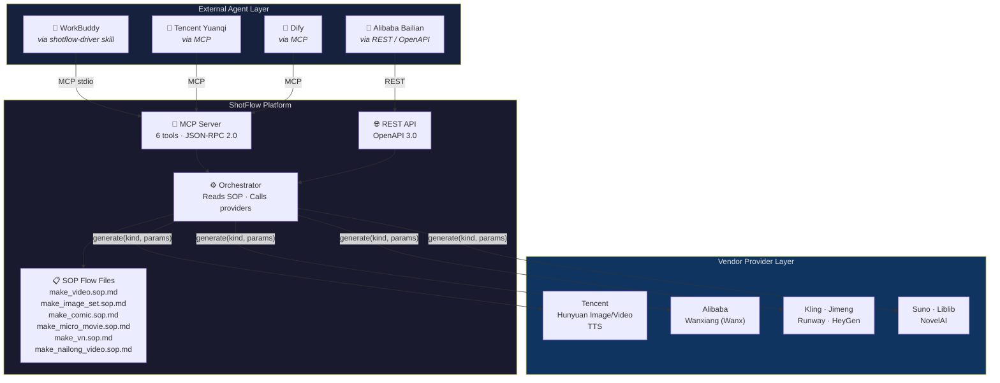
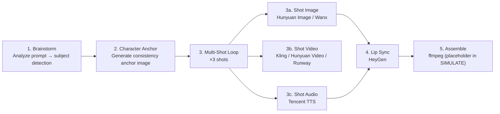
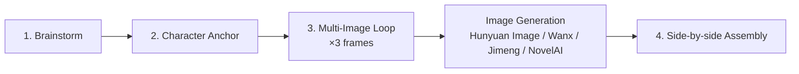
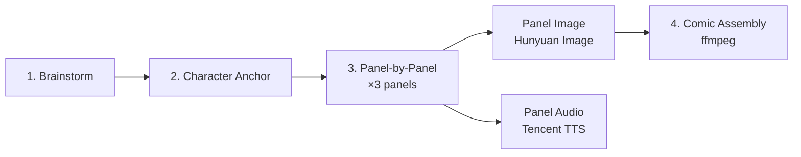
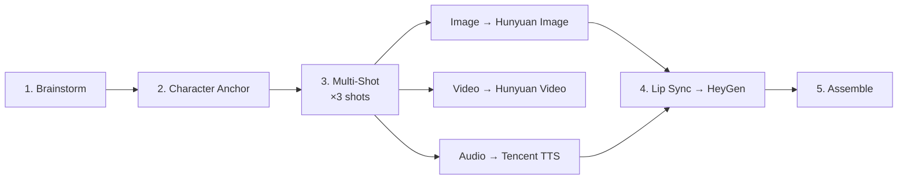
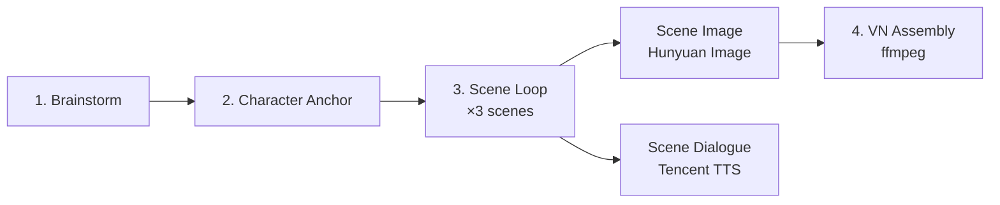

# ShotFlow

[English](README.md) | [中文](README.zh.md) | [日本語](README.ja.md)

> Flow-file-driven AIGC orchestration platform. External agents read SOP definitions and call vendor-agnostic generation tools — no hardcoded brain, full reproducibility.

[](https://github.com/weed33834/ShotFlow/actions/workflows/ci.yml)
[](LICENSE)
[](https://www.python.org/downloads/)
[](https://nodejs.org/)
[](https://github.com/psf/black)

**Keywords**: AI video generation, text-to-video, AIGC, AI orchestration, cinematic AI, FFmpeg, MCP, FastAPI, React, edge-tts, Real-ESRGAN, RIFE, GPT-SoVITS, FunASR, voice cloning, text-to-speech, AI filmmaking, automated video production

---

## Table of Contents

- [What is ShotFlow](#what-is-shotflow)
- [Architecture Overview](#architecture-overview)
- [Features](#features)
- [Supported Providers](#supported-providers)
- [Quick Start](#quick-start)
- [Production Workflows](#production-workflows)
- [MCP Tool Reference](#mcp-tool-reference)
- [Agent Integration](#agent-integration)
- [Project Structure](#project-structure)
- [FAQ](#faq)
- [Contributing](#contributing)
- [License](#license)

---

## What is ShotFlow

ShotFlow is an **AIGC (AI-Generated Content) orchestration platform** built on a
single principle: separate the *what* from the *how*.

Rather than embedding generation logic in a monolithic pipeline, ShotFlow
provides three components:

1. **SOP flow files** — Markdown documents that define, step by step, how to
   produce a given output type (video, image set, comic, micro-movie, visual
   novel).
2. **Vendor-agnostic generation tools** — Exposed through both a REST API and
   MCP (Model Context Protocol), so any agent framework can call them.
3. **13 provider integrations** — From Tencent Hunyuan to Runway, HeyGen, and
   NovelAI, all behind a uniform `BaseProvider` interface.

External agents — WorkBuddy, Tencent Yuanqi, Alibaba Bailian, or Dify — read
the SOP flow files and drive the tools. ShotFlow does not hardcode a "brain"; it
supplies the tools and the instructions agents need to act.

---

## Architecture Overview



---

## Features

### Core Design

- **Flow-file driven**: Every production pipeline is defined as an SOP Markdown
  file. Change the SOP to change the output — no code changes required.
- **No hardcoded brain**: ShotFlow provides tools, not decisions. External
  agents read the SOP and orchestrate independently.
- **SIMULATE mode**: Develop and test the full pipeline without a GPU or API
  credentials. All providers return placeholder assets.

### Cinematic Prompt System

- **13 style presets**: cinematic, cyberpunk, anime, ink_wash, ghibli,
  oil_painting, realistic, watercolor, documentary, wes_anderson, scifi,
  fantasy, noir — each injects professional image/video suffixes and negative
  prompts into the LLM system prompt.
- **10 scene templates**: product, food, travel, knowledge, story, city,
  nature, action, interview, tutorial — each defines shot rhythm, shot
  sequence, lighting, and transition style.
- **Cinematic keyword library**: 15 lighting types, 15 camera angles, 15 camera
  movements, and 15 mood keywords — sampled to enrich fallback prompts when no
  LLM is configured.
- **Quality levels**: standard (1080p), hd (1080p + bokeh), 4k (4K HDR ACES),
  8k (8K HDR Dolby Vision) — controls technical parameters embedded in prompts.

### Advanced Video Pipeline (FFmpeg)

- **xfade transitions**: 13 effects (fade, wipeleft, circleopen, distance,
  zoomin, smoothup, etc.) for cross-dissolves between segments.
- **Ken Burns effect**: a zoompan filter for static images — slow zoom in/out
  with alternating directions for visual variety.
- **Color grading**: 5 presets (vintage, cross_process, teal_orange,
  high_contrast, warm_film) via FFmpeg `curves` + `eq` filters.
- **60s+ long video**: an xfade chain with offset calculation supports an
  unlimited segment count for coherent long-form output.

### Open-Source AI Alternatives

Every open-source tool degrades gracefully — if it is not installed, the
pipeline logs a warning and continues without crashing.

| Feature | Commercial | Open-Source Alternative |
|---|---|---|
| ASR (Speech-to-Text) | OpenAI Whisper API | [FunASR](https://github.com/modelscope/FunASR) (paraformer-zh/en) |
| TTS Voice Cloning | CosyVoice (Alibaba) | [GPT-SoVITS](https://github.com/RVC-Boss/GPT-SoVITS) (local API) |
| Video Super-Resolution | — | [Real-ESRGAN](https://github.com/xinntao/Real-ESRGAN) (ncnn-vulkan) |
| Frame Interpolation | — | [RIFE](https://github.com/hzwer/ECCV2022-RIFE) (ncnn-vulkan) |

### Provider Support

- **13 providers** integrated behind a uniform `BaseProvider` ABC (12 cloud +
  1 open-source).
- **MCP + REST dual exposure**: Both protocols are available for broad
  agent-framework compatibility.
- **Easy to extend**: Add a provider by implementing `generate(kind, params)`
  and registering it in `app/services/providers/__init__.py`.

### Reproducibility

- Every generation step saves a complete `Spec` record to the database,
  capturing parameters, provider, and output asset references.
- Results can be re-examined, compared, and re-run.
- The project ships a changelog and full version control.

### Agent Ecosystem Ready

- **WorkBuddy skill**: `shotflow-driver` generates a video from a single
  sentence.
- **MCP manifest**: Drop `integration/shotflow.mcp.json` into any MCP client to
  discover all 6 tools.
- **OpenAPI spec**: Import `integration/openapi.json` into code generators
  (OpenAPI Generator, Postman, etc.).

---

## Supported Providers

| Provider | Type | Status | Requires |
|---|---|---|---|
| Hunyuan Image | Image Generation | ✅ | SecretID / SecretKey |
| Hunyuan Video | Video Generation | ✅ | SecretID / SecretKey |
| Tencent TTS | Text-to-Speech | ✅ | SecretID / SecretKey |
| Wanxiang / Wanx | Image Generation | ✅ | API Key |
| Kling | Video Generation | ✅ | API Key + Base URL |
| Jimeng | Image Generation | ✅ | API Key + Base URL |
| Runway | Video Generation | ✅ | API Key |
| HeyGen | Lip-Sync Video | ✅ | API Key |
| Suno | Music Generation | ✅ | API Key |
| Liblib | Image Generation | ✅ | API Key |
| NovelAI | Image Generation | ✅ | API Key |
| CosyVoice | Voice Cloning | ✅ | API Key |
| GPT-SoVITS | Voice Cloning (Open-Source) | ✅ | Local API URL |

All providers support `SIMULATE_MODE=true` — set this in `.env` to exercise the
full pipeline without any keys.

---

## Quick Start

### Option A: Docker (Recommended)

```bash
git clone https://github.com/weed33834/ShotFlow.git
cd ShotFlow
docker compose up -d
```

- Frontend: http://localhost:3000
- Backend API: http://localhost:8000
- API Docs: http://localhost:8000/docs

`SIMULATE_MODE` is enabled by default — no API keys required.

### Option B: Local Development

#### Prerequisites

- Python 3.10+
- Node.js 22+ (for frontend development)
- FFmpeg (for video assembly)
- (Optional) PostgreSQL for production

#### 1. Clone and Set Up

```bash
git clone https://github.com/weed33834/ShotFlow.git
cd ShotFlow

# Backend
python -m venv venv
source venv/bin/activate  # Linux/macOS
# venv\Scripts\activate   # Windows
pip install -r backend/requirements.txt

# Environment
cp .env.example .env
# Edit .env if you have API keys; SIMULATE_MODE=true works out of the box
```

### 2. Initialize Database

```bash
PYTHONPATH=backend python backend/init_db.py
```

### 3. Start the Server

```bash
# Backend API
PYTHONPATH=backend uvicorn app.main:app --reload --port 8000

# Frontend (separate terminal)
cd frontend
npm install
npm run dev
```

### 4. Generate a Video (SIMULATE)

```bash
curl -X POST http://localhost:8000/api/v1/generate \
  -H "Content-Type: application/json" \
  -d '{
    "nl_prompt": "A happy little egg-yolk creature laughing on grass",
    "output_type": "video"
  }'
```

This runs the `make_video.sop.md` workflow in SIMULATE mode and returns a spec
ID with placeholder asset URLs.

### 5. Verify MCP Server

```bash
PYTHONPATH=backend python -m app.services.mcp_server
```

The server logs `FastMCP 3.4.4` and registers 6 tools, then waits for
stdio-based agent communication.

---

## Production Workflows

Each workflow is defined as an SOP Markdown file in `flows/`. The available
flows and their step sequences are listed below.

### Video Production (`flows/make_video.sop.md`)



### Image Set (`flows/make_image_set.sop.md`)



### Comic / Dynamic Comic (`flows/make_comic.sop.md`)



### Micro-Movie (`flows/make_micro_movie.sop.md`)



### Visual Novel (`flows/make_vn.sop.md`)



---

## MCP Tool Reference

ShotFlow exposes 6 tools through its MCP server (`app.services.mcp_server`).

| Tool | Description | Parameters |
|---|---|---|
| `consistency_anchor` | Generate a character-consistency anchor image from a prompt | `provider, prompt, reference_images?` |
| `generate_image` | Generate an image via a named provider | `provider, prompt, ref_images?, params?` |
| `generate_video` | Generate a video from text or an input image | `provider, prompt, image_urls?, duration, params?` |
| `generate_audio` | Generate audio (TTS) from text | `provider, text, voice?, audio_type?` |
| `lip_sync` | Sync audio with a talking-head video | `provider, video_url, audio_url` |
| `assemble` | Combine assets into a final output | `spec_id?, asset_ids?, subtitles?` |

### MCP Transport

The server listens on **stdio** by default (standard MCP transport). To use a
streamable HTTP transport, configure your MCP client to proxy through the
ShotFlow REST API or use an SSE bridge.

### MCP Manifest

Use `integration/shotflow.mcp.json` for zero-configuration discovery:

```json
{
  "mcpServers": {
    "ShotFlow": {
      "command": "python",
      "args": ["-m", "app.services.mcp_server"],
      "env": {
        "PYTHONPATH": "backend",
        "SIMULATE_MODE": "true"
      }
    }
  }
}
```

---

## Agent Integration

ShotFlow is designed to be driven by external AI agents. Three integration
paths are available.

### Path 1: WorkBuddy (via shotflow-driver skill)

The `shotflow-driver` skill is installed at `~/.workbuddy/skills/shotflow-driver/`.
When you tell WorkBuddy:

> "用 ShotFlow 出一份奶龙视频"

It reads `flows/make_nailong_video.sop.md`, calls the 6 MCP tools in sequence,
and returns the final assembled output.

### Path 2: Any MCP Client (Tencent Yuanqi, Dify, etc.)

1. Copy `integration/shotflow.mcp.json` into your MCP client configuration.
2. The client auto-discovers all 6 tools.
3. The client reads the SOP flow files and orchestrates tool calls.

### Path 3: REST API (Alibaba Bailian, custom agents)

- Full OpenAPI 3.0 spec: `integration/openapi.json`
- Base URL: `http://localhost:8000/api/v1`
- Key endpoints: `/generate`, `/anchor`, `/assemble`, `/spec`, `/tools/assets`

### Edge Deployment

For latency-sensitive scenarios (preview rendering, real-time dialogue),
consider deploying the MCP server to edge functions:

- **Tencent EdgeOne Makers**: Agent-native hosting with global CDN acceleration.
- **Alibaba Function Compute**: Deploy ShotFlow tools as stateless functions
  behind the MCP protocol, with confidential computing (TDX) for credential
  protection.

---

## Project Structure

```
shotflow/
├── backend/
│   ├── app/
│   │   ├── api/v1/           # REST endpoints
│   │   ├── core/             # Config, security
│   │   ├── models/           # SQLAlchemy models
│   │   ├── prompts/          # Cinematic style/scene/keyword libraries
│   │   ├── schemas/          # Pydantic schemas
│   │   └── services/
│   │       ├── providers/    # 13 provider integrations
│   │       ├── mcp_server.py # MCP tool definitions
│   │       ├── orchestrator.py
│   │       └── tools_service.py
│   ├── tests/
│   └── requirements.txt
├── frontend/
│   └── src/
│       ├── api/              # API client
│       ├── layouts/          # App layout
│       ├── pages/            # Generate, Workflows, Assets
│       └── types/            # TypeScript types
├── flows/                    # SOP flow files
│   ├── make_video.sop.md
│   ├── make_image_set.sop.md
│   ├── make_comic.sop.md
│   ├── make_micro_movie.sop.md
│   ├── make_vn.sop.md
│   └── make_nailong_video.sop.md
├── integration/              # Exposure package
│   ├── shotflow.mcp.json
│   ├── openapi.json
│   ├── server_card.json
│   └── AGENT_INTEGRATION_GUIDE.md
├── .env.example
├── LICENSE
├── README.md
└── CHANGELOG.md
```

---

## FAQ

**Q: Does ShotFlow require a GPU?**
A: No. All generation is offloaded to cloud vendor APIs. For development and
testing, SIMULATE mode returns placeholder assets without a GPU or keys.

**Q: Can I add my own provider?**
A: Yes. Create a class inheriting from `BaseProvider`, implement
`generate(kind, params)` returning `AssetResult`, and register it in
`app/services/providers/__init__.py`.

**Q: Is there authentication for the REST API?**
A: Not built-in. Use a reverse proxy (Nginx, Caddy) with authentication for
production deployments.

**Q: Does ShotFlow store generated content?**
A: Asset references (URLs, metadata) are stored in the database. The actual
media files live on the vendor's platform or your configured storage.

---

## Contributing

Contributions are welcome. Please read [CONTRIBUTING.md](CONTRIBUTING.md) and
the [Code of Conduct](CODE_OF_CONDUCT.md) before submitting a pull request.

---

## License

ShotFlow is open source under the **MIT License**. See [LICENSE](LICENSE) for
the full text.

---

*ShotFlow — SOP-driven AIGC, agent-native by design.*
