# ShotFlow

> Script in, 4K master out — a reproducible AIGC short-film pipeline.

[](./LICENSE)
[](https://www.python.org/downloads/)
[](./.github/workflows/ci.yml)
[](./03_Workflows/)
[](./docker-compose.yml)
[](https://ms33834.github.io/ShotFlow/)

English | [中文](./README.zh.md) | [Multilingual docs](./docs/i18n/README.md)

ShotFlow turns AIGC short-film making from a stack of one-off prompts into a reproducible pipeline. The example film, *Echo of the Singularity*, runs through every stage — script, character bible, 29 keyframes, 24 shots, audio, grade, 4K master — with parameters logged at each step so a take can be reproduced, reviewed, and handed off.

Grab the whole pipeline for a new film, or lift a single piece — the character-consistency setup, the render queue, the QA scripts — and drop it into something already in flight.

---

## Why this exists

AIGC video tools are powerful but brittle. A short film hits the same walls every time:

- The same character looks like a different person in every shot.
- Footage flickers, warps, or moves in ways nothing should move.
- Prompts and the storyboard drift apart, and the gap only shows up in the edit.
- Parameters vanish between sessions, so a good take can never be rerun.
- Files get renamed, overwritten, or lost across a small team.

ShotFlow ties these loose ends into one pipeline so a result is reproducible and a team can actually collaborate on it. It is a template, not a product — swap in a story and go.

---

## The pipeline at a glance

```mermaid
flowchart TB
    subgraph Pre["Pre-production"]
        A[Script & world-building]
        B[Character bible]
        C[24-shot storyboard]
    end
    subgraph Asset["Assets"]
        D[Flux.1 Kontext + IPAdapter]
        E[29 keyframes]
    end
    subgraph Motion["Motion"]
        F[Wan2.2 I2V 14B]
        G[Kling 2.5 Turbo]
        H[19 standard shots]
        I[5 complex shots]
    end
    subgraph Post["Post"]
        J[DaVinci edit & grade]
        K[ElevenLabs voice]
        L[Suno score]
        M[Topaz 4K upscale]
    end
    subgraph Release["Release"]
        N[4K master]
        O[Workflow package]
        P[Tutorial & release]
    end
    A --> D
    B --> D
    C --> E
    D --> E
    E --> F
    E --> G
    F --> H
    G --> I
    H --> J
    I --> J
    J --> M
    K --> J
    L --> J
    M --> N
    N --> O
    O --> P
```



The full chain, with the reasoning behind each choice, is in [`AIGC_Experience_Chain.md`](./AIGC_Experience_Chain.md).

---

## Mirrors

| Platform | URL |
|----------|-----|
| GitHub | https://github.com/MS33834/ShotFlow |
| GitCode | https://gitcode.com/badhope/ShotFlow |
| Project site | https://ms33834.github.io/ShotFlow/ |

Both stay in sync via [`08_Automation/sync_repos.sh`](./08_Automation/sync_repos.sh).

---

## Repository layout

```
ShotFlow/
├── 01_Assets/              # Characters, scenes, audio assets
├── 02_Scripts/             # Script, storyboard, prompts
├── 03_Workflows/           # ComfyUI JSON workflows
├── 04_SOP/                 # Manuals and production standards
├── 05_Output/              # Final deliverables
├── 06_Research/            # Tech stack, budget, licensing, tuning notes
├── 07_Team/                # Team roles and PM templates
├── 08_Automation/          # Deployment, generation, QA, sync scripts
├── 09_Release/             # Release checklists and showcase templates
├── backend/                # Web platform backend (FastAPI + SQLAlchemy + Celery)
├── frontend/               # Web platform admin UI (React + Vite + Ant Design Pro)
├── examples/               # Samples + the Echo of the Singularity case study
├── docs/                   # Tutorial, blog, i18n index
├── tests/                  # Health-check tests
├── .github/                # CI, Issue/PR templates, CODEOWNERS, Dependabot
├── AIGC_Experience_Chain.md   # End-to-end pipeline reasoning
├── CHANGELOG.md
├── CODE_OF_CONDUCT.md
├── CONTRIBUTING.md
├── COST_ANALYSIS.md
├── Dockerfile
├── LICENSE
├── Makefile
├── README.md               # English (primary)
├── README.zh.md            # 中文
├── SECURITY.md
├── TROUBLESHOOTING.md
├── docker-compose.yml
└── pyproject.toml
```

---

## Tech stack

| Stage | Tool / Model | What it does here |
|-------|--------------|-------------------|
| Writing | DeepSeek / Claude | Script, world, character bible |
| Character consistency | Flux.1 Kontext + IPAdapter | Reference images and keyframes that stay on-model |
| Standard shots | Wan2.2 I2V 14B | Image-to-video for dialogue and close-ups |
| Complex shots | Kling 2.5 Turbo | Keyframe-to-keyframe for movement and transitions |
| Edit & grade | DaVinci Resolve | Cut and Teal-&-Orange grade |
| Voice | ElevenLabs | Character dialogue |
| Music | Suno / Udio | Atmospheric score |
| Upscale | Topaz Video AI | 4K and denoise |
| Pipeline host | ComfyUI | Node-based generation |

---

## Quick start

> New here? The [step-by-step tutorial](./docs/tutorial.md) ([中文](./docs/tutorial.zh.md)) walks from an empty repo to a 4K master, one command at a time.

### Option 1 — Docker (fastest look)

```bash
docker compose up -d
```

The image ships with Python deps and project scripts. ComfyUI and model weights aren't bundled (licensing + size) — pull them with [`08_Automation/deploy_comfyui.sh`](./08_Automation/deploy_comfyui.sh).

### Option 2 — Local source

```bash
git clone https://github.com/MS33834/ShotFlow.git
cd ShotFlow

cp .env.example .env       # fill KLING_API_KEY, ELEVENLABS_API_KEY, SUNO_API_KEY, ...
bash 08_Automation/deploy_comfyui.sh   # needs NVIDIA GPU, RTX 4090 24GB recommended
make setup                 # install Python deps (black, isort, pytest included)
make check                 # verify project structure

python 08_Automation/preflight_check.py --dry-run     # structure + keys, no GPU needed
python 08_Automation/batch_keyframe_gen.py --dry-run  # preview, then drop the flag
python 08_Automation/storyboard_to_video.py --dry-run
```

Generation scripts call ComfyUI or cloud APIs — run with `--help` or `--dry-run` first. `asset_dashboard.py` and `daily_brief.py` write files by default; use `--dry-run` to preview.

Common `make` targets:

```bash
make help     # list everything
make check    # structure check
make setup    # install deps
make docker   # start the stack
make test     # run checks
make sync     # push to both remotes
make clean    # remove temp files
```

---

## Web platform

Beyond the CLI toolkit, ShotFlow ships a Web platform so non-engineers can drive the pipeline from a browser. The backend wraps the existing `08_Automation` scripts instead of rewriting them — same generation logic, two surfaces.

```bash
docker compose up -d       # PostgreSQL + Redis + backend + Celery worker
# API docs (Swagger): http://localhost:8000/docs
# Health:             http://localhost:8000/api/v1/health
```

`SIMULATE_MODE=true` is on by default — every service returns mock output, so the whole chain runs **without a GPU**. Flip it to `false` on a GPU host to hit the real ComfyUI / Kling / ElevenLabs / Suno backends.

### Backend API

| Route | Purpose |
|-------|---------|
| `/api/v1/auth` | Login / current user / user CRUD (RBAC) |
| `/api/v1/projects` | Project CRUD |
| `/api/v1/shots` | Shot & storyboard management |
| `/api/v1/keyframes` | Keyframe management |
| `/api/v1/videos` | Video clip management |
| `/api/v1/audio` | Dialogue & voiceover |
| `/api/v1/queue` | Render queue: submit / query / retry / cancel |
| `/api/v1/queue/stream/events` | SSE real-time queue status |
| `/api/v1/workflows` | ComfyUI workflow management |
| `/api/v1/workflows-cfg` | YAML workflow config + provider scoring |
| `/api/v1/assets` | Asset gallery (scans disk by type) |
| `/api/v1/qa` | QA reports |
| `/api/v1/daily-briefs` | Daily stand-up briefs |
| `/api/v1/case-studies` | Public case study showcase + admin CRUD |
| `/api/v1/health` | Health check (DB + Redis) |

Interactive docs at `/docs` (Swagger) and `/redoc`.

### Frontend admin console

React 18 + TypeScript + Vite + Ant Design Pro. Covers projects / shots / keyframes / render queue / workflows / dialogue / QA, with SSE real-time queue status.

```bash
cd frontend
npm install
npm run dev       # http://localhost:5173 (proxied to backend :8000)
npm run build
npm run typecheck
```

| Route | Purpose |
|-------|---------|
| `/login` | Login (JWT) |
| `/dashboard` | Overview (health + queue stats + projects) |
| `/projects` | Project CRUD |
| `/shots` | Shot management (filter by project) |
| `/keyframes` | Keyframe management (submit generation) |
| `/queue` | Render queue (SSE + submit/retry/cancel) |
| `/workflows` | ComfyUI workflow management |
| `/workflow-configs` | YAML config + provider scoring |
| `/assets` | Asset gallery (scans disk by type) |
| `/audio` | Dialogue & voiceover |
| `/qa` | QA reports |
| `/case-studies` | Case study showcase |

SSE push uses a `useQueueStream` hook with exponential-backoff reconnect; frontend `types/index.ts` stays in sync with backend `schemas`; Nginx multi-stage build disables SSE proxy buffering.

---

## Examples

- [`examples/character_prompts.md`](./examples/character_prompts.md) — Ava character-consistency prompts
- [`examples/storyboard_sample.md`](./examples/storyboard_sample.md) — simplified storyboard, first 3 shots
- [`examples/comfyui_api_payload.json`](./examples/comfyui_api_payload.json) — ComfyUI API payload
- [`examples/env.example`](./examples/env.example) — minimal env template
- [`examples/echo-of-singularity/`](./examples/echo-of-singularity/) — full case study (bilingual)

---

## The complete short film

The example film *Echo of the Singularity* is not a few demo clips — it is a complete AIGC work, end to end. Every artifact a reviewer would expect from a finished short sits in the repo as a worked example to clone, read, and reuse.

| Phase | Artifact | What it covers |
|-------|----------|----------------|
| Pre-production | [`02_Scripts/`](./02_Scripts/) | Script, worldbuilding, character bible, 24-shot storyboard, keyframe prompts |
| Production plan | [`examples/echo-of-singularity/`](./examples/echo-of-singularity/) | Schedule, production log, character bible, shot tracker |
| Audio planning | [`01_Assets/Audio/voice_bibles.md`](./01_Assets/Audio/voice_bibles.md) | Per-character TTS engine, voice id, stability/style, emotion segments |
| Audio planning | [`01_Assets/Audio/cue_sheet.md`](./01_Assets/Audio/cue_sheet.md) | Every dialogue/music/SFX cue with in/out timecodes and mix rules |
| Audio planning | [`01_Assets/Audio/sfx_list.md`](./01_Assets/Audio/sfx_list.md) | Per-SFX purpose, source (freesound CC0 / AudioLDM), license chain |
| Edit | [`05_Output/EDL/shotflow_v01.edl`](./05_Output/EDL/shotflow_v01.edl) | Edit decision list — the timeline spine |
| Post | [`05_Output/Final/assembly_guide.md`](./05_Output/Final/assembly_guide.md) | How to assemble the locked master from EDL + assets in DaVinci Resolve |
| Post | [`05_Output/Final/color_grading_notes.md`](./05_Output/Final/color_grading_notes.md) | Teal-&-Orange grade recipe, per-scene node graph |
| Post | [`05_Output/Final/final_mix_notes.md`](./05_Output/Final/final_mix_notes.md) | Mix targets, side-chain rules, loudness ceilings |
| Post | [`05_Output/Final/upscale_and_repair_notes.md`](./05_Output/Final/upscale_and_repair_notes.md) | Topaz 4K upscale + defect repair log |
| Inventory | [`05_Output/Final/asset_manifest.md`](./05_Output/Final/asset_manifest.md) | Complete asset list (24 shots / 10 dialogue cues / 6 music cues / 10 SFX / 29 keyframes) + checksum template |
| Subtitles | [`05_Output/Final/subtitles/`](./05_Output/Final/subtitles/) | `.srt` (zh + en) + styled `.ass` for festival burn-in |
| Credits | [`05_Output/Final/credits.md`](./05_Output/Final/credits.md) | Cast, voice, music, tools, license roll |
| Specs | [`05_Output/Final/delivery_specs.md`](./05_Output/Final/delivery_specs.md) | Per-platform master specs (4K / 1080p / vertical / square / ProRes) |
| Release | [`09_Release/distribution_kit.md`](./09_Release/distribution_kit.md) | Per-platform distribution package: title/description/tag templates, AIGC disclosure rules |
| Release | [`09_Release/poster_spec.md`](./09_Release/poster_spec.md) | Per-platform cover & poster specs: sizes, color/font, Flux.1 prompts, layout workflow |
| Compliance | [`06_Research/licensing_compliance.md`](./06_Research/licensing_compliance.md) | Per-tool license audit, commercial-use boundary, budget for commercial upgrade |

The rendered video files themselves (4K master, 1080p web cut, vertical cut, audio master) are **not** committed — they're large and several use NC-licensed model outputs. The paperwork above is the reference; run the pipeline end-to-end to populate the actual media, then follow `assembly_guide.md` to lock the master.

---

## Hardware

| Component | Minimum | Recommended |
|-----------|---------|-------------|
| GPU | RTX 3090 24GB | RTX 4090 24GB |
| RAM | 32GB | 64GB |
| Storage | 200GB SSD | 1TB NVMe |
| OS | Ubuntu 22.04 | Ubuntu 22.04 / Windows 11 |

CPU-only? Use cloud APIs (Kling, Runway) for the video stage.

---

## Contributing & community

Issues and PRs welcome — new ComfyUI workflows, better prompts, script fixes, post-production notes, translations. See [`CONTRIBUTING.md`](./CONTRIBUTING.md) ([中文](./CONTRIBUTING.zh.md), includes the mandatory "check remote state before every push" rule and the monthly open-source health check) and [`CODE_OF_CONDUCT.md`](./CODE_OF_CONDUCT.md) ([中文](./CODE_OF_CONDUCT.zh.md)).

- Troubleshooting: [`TROUBLESHOOTING.md`](./TROUBLESHOOTING.md)
- Cost estimates: [`COST_ANALYSIS.md`](./COST_ANALYSIS.md)
- Changelog: [`CHANGELOG.md`](./CHANGELOG.md)
- Security: [`SECURITY.md`](./SECURITY.md) ([中文](./SECURITY.zh.md))
- Translations: [`docs/i18n/README.md`](./docs/i18n/README.md)

## Acknowledgements

Built on top of open-source work from:
- [ComfyUI](https://github.com/comfyanonymous/ComfyUI) — node-based generation host
- [Flux.1](https://github.com/black-forest-labs/flux) — image model
- [Wan2.2](https://github.com/Wan-Video/Wan2.2) — video model
- [FastAPI](https://fastapi.tiangolo.com/), [SQLAlchemy](https://www.sqlalchemy.org/), [Celery](https://docs.celeryq.dev/)
- [React](https://react.dev/), [Vite](https://vitejs.dev/), [Ant Design](https://ant.design/)
- [DaVinci Resolve](https://www.blackmagicdesign.com/products/davinciresolve), [Topaz Video AI](https://www.topazlabs.com/topaz-video-ai)

Cloud APIs: ElevenLabs, Suno, Kling (PiAPI). The example film *Echo of the Singularity* is case-study content, not affiliated with these projects.

---

## License

[Custom Non-Commercial License (CNCL) v1.0](./LICENSE).

- No rights to use, copy, modify, distribute, sublicense, or operate the software are granted without prior written permission from the author.

The script, characters, shots, dialogue, and music in the example film are case-study content; replace them with your own for your own production.
