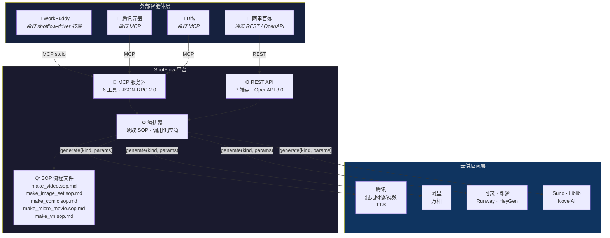
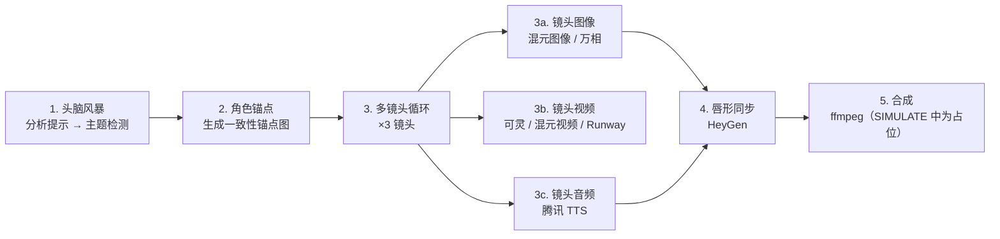
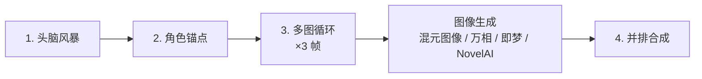
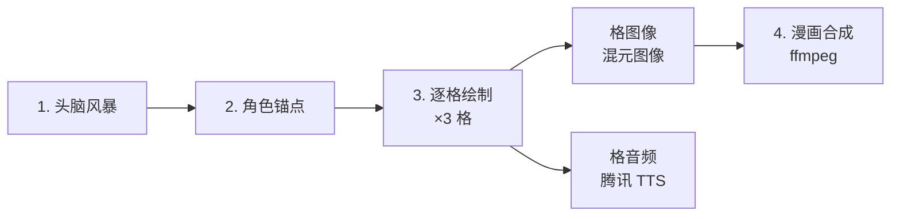
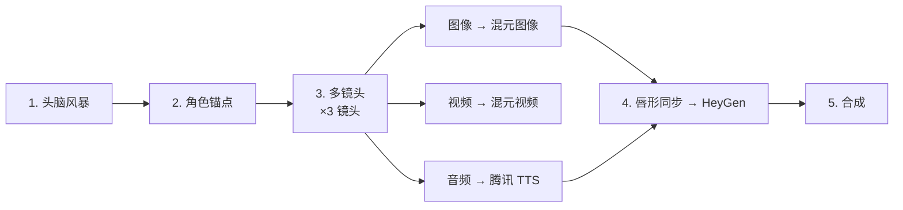
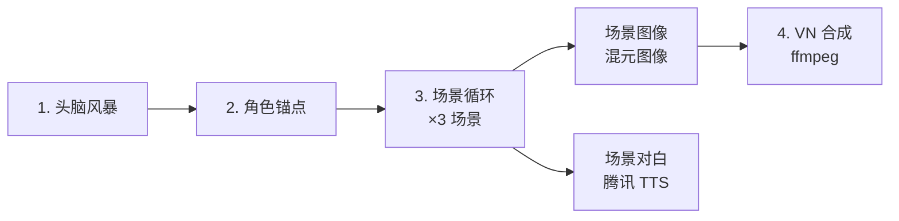

# ShotFlow

> 流程文件驱动的 AIGC 编排平台。外部智能体读取 SOP 定义并调用供应商无关的生成工具——无硬编码大脑，全链路可复现。

[](LICENSE)
[](https://www.python.org/downloads/)
[](https://github.com/psf/black)

[English](README.md) · 中文 · [日本語](README.ja.md)

---

## 目录

- [介绍](#介绍)
- [架构概览](#架构概览)
- [功能特性](#功能特性)
- [支持的供应商](#支持的供应商)
- [快速开始](#快速开始)
- [生产工作流](#生产工作流)
- [MCP 工具参考](#mcp-工具参考)
- [智能体集成](#智能体集成)
- [项目结构](#项目结构)
- [常见问题](#常见问题)
- [贡献指南](#贡献指南)
- [许可证](#许可证)

---

## 介绍

ShotFlow 是一个**AIGC（AI 生成内容）编排平台**，核心理念是分离*做什么*与*怎么做*。

ShotFlow 不嵌入任何生成逻辑，而是提供：

1. **SOP 流程文件**——用 Markdown 定义每种输出类型的完整生产步骤。
2. **供应商无关的生成工具**——通过 REST API 和 MCP 协议暴露，任何智能体框架均可调用。
3. **11 家云供应商集成**——从腾讯混元到 Runway、HeyGen、NovelAI，统一 `BaseProvider` 接口。

外部智能体（WorkBuddy、腾讯元器、阿里百炼、Dify 等）读取 SOP 流程文件并驱动工具。ShotFlow 从不硬编码"大脑"，它只给智能体所需的工具和操作说明。

---

## 架构概览



---

## 功能特性

### 核心设计

- **流程文件驱动**：每个生产管线定义为 SOP Markdown 文件。修改 SOP 即修改输出，无需改代码。
- **无硬编码大脑**：ShotFlow 提供工具而非决策。外部智能体读取 SOP 后自行编排。
- **SIMULATE 模式**：无需 GPU 或 API 密钥即可开发和测试全链路。所有供应商返回占位资产。

### 供应商支持

- **11 家云供应商**集成于统一的 `BaseProvider` 抽象类。
- **MCP + REST 双协议暴露**，最大限度兼容各类智能体框架。
- **易于扩展**：实现 `generate(kind, params)` 并注册在 `app/services/providers/__init__.py` 即可。

### 可复现性

- 每次生成步骤都将完整的 `Spec` 记录存入数据库，包含参数、供应商和输出资产引用。
- 结果可复查、比较和重跑。
- 项目自带变更日志和版本控制。

### 智能体生态就绪

- **WorkBuddy 技能**：`shotflow-driver`——一句话生成视频。
- **MCP 清单**：将 `integration/shotflow.mcp.json` 导入任何 MCP 客户端，即刻发现全部 6 个工具。
- **OpenAPI 规范**：导入 `integration/openapi.json` 到代码生成器（OpenAPI Generator、Postman 等）。

---

## 支持的供应商

| 供应商 | 类型 | 状态 | 需要 |
|---|---|---|---|
| 混元图像 | 图像生成 | ✅ | SecretID / SecretKey |
| 混元视频 | 视频生成 | ✅ | SecretID / SecretKey |
| 腾讯 TTS | 文本转语音 | ✅ | SecretID / SecretKey |
| 万相 | 图像生成 | ✅ | API Key |
| 可灵 | 视频生成 | ✅ | API Key + Base URL |
| 即梦 | 图像生成 | ✅ | API Key + Base URL |
| Runway | 视频生成 | ✅ | API Key |
| HeyGen | 唇形同步视频 | ✅ | API Key |
| Suno | 音乐生成 | ✅ | API Key |
| Liblib | 图像生成 | ✅ | API Key |
| NovelAI | 图像生成 | ✅ | API Key |

所有供应商支持 `SIMULATE_MODE=true`——在 `.env` 中设置此项，无需任何密钥即可测试全链路。

---

## 快速开始

### 前置条件

- Python 3.12+
- Node.js 22+（前端开发）
- （可选）PostgreSQL（生产环境）

### 1. 克隆与安装

```bash
git clone https://github.com/weed33834/ShotFlow.git
cd ShotFlow

# 后端
python -m venv venv
# source venv/bin/activate  # Linux/macOS
# venv\Scripts\activate     # Windows
pip install -r backend/requirements.txt

# 环境变量
cp .env.example .env
# 如有 API 密钥请编辑 .env；SIMULATE_MODE=true 开箱即用
```

### 2. 初始化数据库

```bash
PYTHONPATH=backend python backend/init_db.py
```

### 3. 启动服务

```bash
# 后端 API
PYTHONPATH=backend uvicorn app.main:app --reload --port 8000

# 前端（另开终端）
cd frontend
npm install
npm run dev
```

### 4. 生成视频（SIMULATE 模式）

```bash
curl -X POST http://localhost:8000/api/v1/generate \
  -H "Content-Type: application/json" \
  -d '{
    "nl_prompt": "A happy little egg-yolk creature laughing on grass",
    "output_type": "video"
  }'
```

该命令以 SIMULATE 模式运行 `make_video.sop.md` 工作流，返回 spec ID 和占位资产 URL。

### 5. 验证 MCP 服务器

```bash
PYTHONPATH=backend python -m app.services.mcp_server
```

服务器日志打印 `FastMCP 3.4.4` 并注册 6 个工具，然后等待基于 stdio 的智能体通信。

---

## 生产工作流

以下为可用的流程文件及其步骤序列。

### 视频制作 (`flows/make_video.sop.md`)



### 图像集 (`flows/make_image_set.sop.md`)



### 漫画 / 动态漫画 (`flows/make_comic.sop.md`)



### 微电影 (`flows/make_micro_movie.sop.md`)



### 视觉小说 (`flows/make_vn.sop.md`)



---

## MCP 工具参考

ShotFlow 通过 MCP 服务器暴露 6 个工具。

| 工具 | 描述 | 参数 |
|---|---|---|
| `consistency_anchor` | 根据提示生成角色一致性锚点图像 | `prompt: str` |
| `generate_image` | 通过指定供应商生成图像 | `provider, prompt, size, ...` |
| `generate_video` | 从文本或输入图像生成视频 | `provider, prompt, image?, seconds, ...` |
| `generate_audio` | 从文本生成音频（TTS） | `provider, text, voice?` |
| `lip_sync` | 将音频与说话头视频同步 | `provider, video_url, audio_url` |
| `assemble` | 将资产合成为最终输出 | `shots: list[ShotAssets], output_type` |

### MCP 传输

服务器默认监听 **stdio**（标准 MCP 传输）。如需 streamable HTTP 传输，请配置 MCP 客户端通过 ShotFlow REST API 代理或使用 SSE 桥接。

### MCP 清单

使用 `integration/shotflow.mcp.json` 实现零配置发现：

```json
{
  "mcpServers": {
    "shotflow": {
      "command": "python",
      "args": ["-m", "app.services.mcp_server"],
      "cwd": "/path/to/shotflow",
      "env": {
        "PYTHONPATH": "backend"
      }
    }
  }
}
```

---

## 智能体集成

### WorkBuddy（通过 shotflow-driver 技能）

`shotflow-driver` 技能已安装于 `~/.workbuddy/skills/shotflow-driver/`。对 WorkBuddy 说"用 ShotFlow 出一份视频"，它即读取流程文件、按序调用 6 个 MCP 工具并返回成品。

### 任意 MCP 客户端（腾讯元器、Dify 等）

1. 将 `integration/shotflow.mcp.json` 复制到 MCP 客户端配置。
2. 客户端自动发现全部 6 个工具。
3. 客户端读取 SOP 流程文件并编排工具调用。

### REST API（阿里百炼、自定义智能体）

- 完整 OpenAPI 3.0 规范：`integration/openapi.json`
- 基础 URL：`http://localhost:8000/api/v1`
- 端点：`/generate`、`/anchor`、`/assemble`、`/spec`、`/tools/assets`

### Edge 部署

对延迟敏感的场景（预览渲染、实时对白），可将 MCP 服务器部署到边缘函数：

- **腾讯 EdgeOne Makers**：全球 CDN 加速的 Agent 原生托管。
- **阿里函数计算**：将 ShotFlow 工具作为无状态函数部署，配合机密计算（TDX）保护凭据。

---

## 项目结构

```
shotflow/
├── backend/
│   ├── app/
│   │   ├── api/v1/           # REST 端点
│   │   ├── core/             # 配置、数据库
│   │   ├── models/           # SQLAlchemy 模型
│   │   ├── schemas/          # Pydantic 模式
│   │   └── services/
│   │       ├── providers/    # 11 家供应商集成
│   │       ├── mcp_server.py # MCP 工具定义
│   │       ├── orchestrator.py
│   │       └── tools_service.py
│   ├── tests/
│   └── requirements.txt
├── frontend/
│   └── src/
│       ├── api/              # API 客户端
│       ├── layouts/          # 布局组件
│       ├── pages/            # Generate、Workflows、Assets
│       └── types/            # TypeScript 类型
├── flows/                    # SOP 流程文件
├── integration/              # 暴露包
├── .env.example
├── LICENSE
├── README.md
└── CHANGELOG.md
```

---

## 常见问题

**问：ShotFlow 需要 GPU 吗？**
答：不需要。所有生成都卸载到云供应商 API。开发和测试时，SIMULATE 模式无需 GPU 或密钥即可返回占位资产。

**问：我可以添加自己的供应商吗？**
答：可以。创建继承 `BaseProvider` 的新类，实现 `generate(kind, params)` 返回 `AssetResult`，然后在 `app/services/providers/__init__.py` 中注册即可。

**问：REST API 有认证吗？**
答：不内置。生产部署请使用反向代理（Nginx、Caddy）添加认证层。

---

## 贡献指南

欢迎贡献。提交 Pull Request 前请阅读 [CONTRIBUTING.md](CONTRIBUTING.md) 和 [CODE_OF_CONDUCT.md](CODE_OF_CONDUCT.md)。

---

## 许可证

ShotFlow 采用 **MIT 许可证**开源。全文见 [LICENSE](LICENSE)。

---

*ShotFlow — SOP 驱动、Agent 原生的 AIGC 编排平台。*
