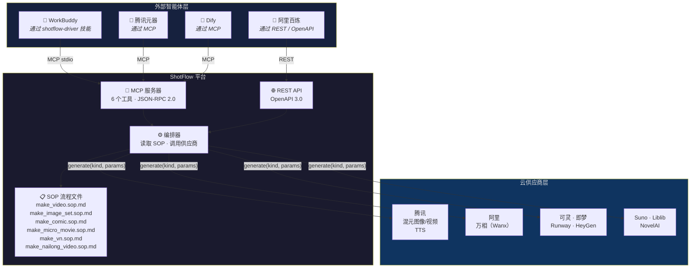
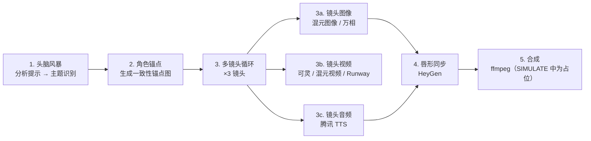
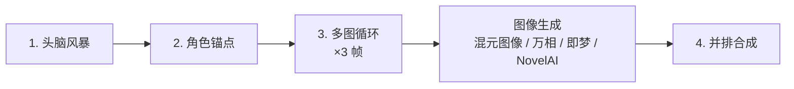
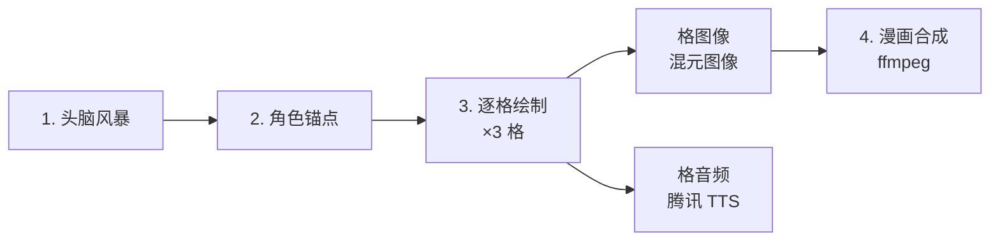
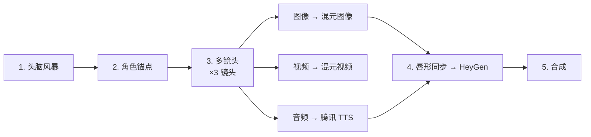
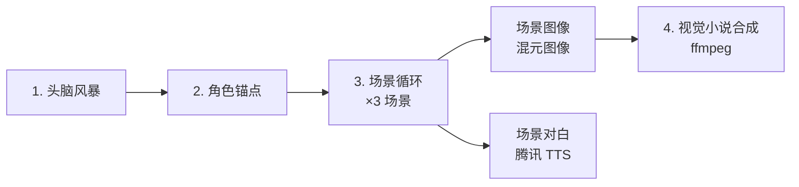

# ShotFlow

[English](README.md) | [中文](README.zh.md) | [日本語](README.ja.md)

> 流程文件驱动的 AIGC 编排平台。外部智能体读取 SOP 定义并调用供应商无关的生成工具——无硬编码大脑，全链路可复现。

[](https://github.com/weed33834/ShotFlow/actions/workflows/ci.yml)
[](LICENSE)
[](https://www.python.org/downloads/)
[](https://nodejs.org/)
[](https://github.com/psf/black)

**关键词**：AI 视频生成、文生视频、AIGC、AI 编排、电影感 AI、FFmpeg、MCP、FastAPI、React、edge-tts、Real-ESRGAN、RIFE、GPT-SoVITS、FunASR、声音克隆、文本转语音、AI 影视制作、自动化视频生产

---

## 目录

- [ShotFlow 是什么](#shotflow-是什么)
- [架构概览](#架构概览)
- [功能特性](#功能特性)
- [支持的供应商](#支持的供应商)
- [快速开始](#快速开始)
- [生产工作流](#生产工作流)
- [MCP 工具参考](#mcp-工具参考)
- [智能体集成](#智能体集成)
- [项目结构](#项目结构)
- [常见问题](#常见问题)
- [贡献指南](#贡献指南)
- [许可证](#许可证)

---

## ShotFlow 是什么

ShotFlow 是一个 **AIGC（AI 生成内容）编排平台**，遵循一条原则：把*做什么*与*怎么做*分开。

ShotFlow 不把生成逻辑塞进单体流水线，而是提供三个组件：

1. **SOP 流程文件**——用 Markdown 逐步定义每种输出类型（视频、图像集、漫画、微电影、视觉小说）的生产步骤。
2. **供应商无关的生成工具**——同时通过 REST API 与 MCP（Model Context Protocol）暴露，任意智能体框架均可调用。
3. **13 个供应商集成**——从腾讯混元到 Runway、HeyGen、NovelAI，统一封装在 `BaseProvider` 接口之下。

外部智能体（WorkBuddy、腾讯元器、阿里百炼、Dify 等）读取 SOP 流程文件并驱动这些工具。ShotFlow 不硬编码"大脑"，只提供工具和操作说明，由智能体自行决策。

---

## 架构概览



---

## 功能特性

### 核心设计

- **流程文件驱动**：每条生产流水线都定义为一份 SOP Markdown 文件。改 SOP 即改输出，无需改动代码。
- **无硬编码大脑**：ShotFlow 提供工具而非决策。外部智能体读取 SOP 后自行编排。
- **SIMULATE 模式**：无需 GPU 或 API 密钥即可开发与测试全链路。所有供应商返回占位资产。

### 电影感提示词系统

- **13 套风格预设**：cinematic、cyberpunk、anime、ink_wash、ghibli、oil_painting、realistic、watercolor、documentary、wes_anderson、scifi、fantasy、noir——每套向 LLM 系统提示词注入专业图像/视频后缀与负向提示词。
- **10 个场景模板**：product、food、travel、knowledge、story、city、nature、action、interview、tutorial——每个定义镜头节奏、镜头序列、光照与转场风格。
- **电影感关键词库**：15 种光照、15 种机位角度、15 种运镜、15 种情绪关键词——在未配置 LLM 时采样以丰富回退提示词。
- **画质档位**：standard（1080p）、hd（1080p + 散景）、4k（4K HDR ACES）、8k（8K HDR Dolby Vision）——控制写入提示词的技术参数。

### 进阶视频流水线（FFmpeg）

- **xfade 转场**：13 种特效（fade、wipeleft、circleopen、distance、zoomin、smoothup 等），用于片段间的交叉溶解。
- **Ken Burns 效果**：对静态图片用 zoompan 滤镜——缓慢推拉镜头、方向交替，增加画面变化。
- **调色**：5 套预设（vintage、cross_process、teal_orange、high_contrast、warm_film），通过 FFmpeg `curves` + `eq` 滤镜实现。
- **60 秒以上长视频**：基于 xfade 链与 offset 计算，支持任意片段数，输出连贯的长视频。

### 开源 AI 替代方案

所有开源工具均优雅降级——未安装时流水线仅打印告警并继续运行，不会崩溃。

| 能力 | 商业方案 | 开源替代 |
|---|---|---|
| ASR（语音转文本） | OpenAI Whisper API | [FunASR](https://github.com/modelscope/FunASR)（paraformer-zh/en） |
| TTS 声音克隆 | CosyVoice（阿里） | [GPT-SoVITS](https://github.com/RVC-Boss/GPT-SoVITS)（本地 API） |
| 视频超分辨率 | — | [Real-ESRGAN](https://github.com/xinntao/Real-ESRGAN)（ncnn-vulkan） |
| 插帧 | — | [RIFE](https://github.com/hzwer/ECCV2022-RIFE)（ncnn-vulkan） |

### 供应商支持

- **13 个供应商**集成于统一的 `BaseProvider` 抽象基类之下（12 个云 + 1 个开源）。
- **MCP + REST 双协议暴露**：兼顾各类智能体框架的兼容性。
- **易于扩展**：实现 `generate(kind, params)` 并在 `app/services/providers/__init__.py` 注册即可接入新供应商。

### 可复现性

- 每一步生成都会把完整的 `Spec` 记录写入数据库，包含参数、供应商与输出资产引用。
- 结果可复查、可对比、可重跑。
- 项目附带变更日志与完整版本控制。

### 智能体生态就绪

- **WorkBuddy 技能**：`shotflow-driver` 可一句话出视频。
- **MCP 清单**：把 `integration/shotflow.mcp.json` 放进任意 MCP 客户端即可发现全部 6 个工具。
- **OpenAPI 规范**：把 `integration/openapi.json` 导入代码生成器（OpenAPI Generator、Postman 等）。

---

## 支持的供应商

| 供应商 | 类型 | 状态 | 需要 |
|---|---|---|---|
| 混元图像 | 图像生成 | ✅ | SecretID / SecretKey |
| 混元视频 | 视频生成 | ✅ | SecretID / SecretKey |
| 腾讯 TTS | 文本转语音 | ✅ | SecretID / SecretKey |
| 万相 / Wanx | 图像生成 | ✅ | API Key |
| 可灵 | 视频生成 | ✅ | API Key + Base URL |
| 即梦 | 图像生成 | ✅ | API Key + Base URL |
| Runway | 视频生成 | ✅ | API Key |
| HeyGen | 唇形同步视频 | ✅ | API Key |
| Suno | 音乐生成 | ✅ | API Key |
| Liblib | 图像生成 | ✅ | API Key |
| NovelAI | 图像生成 | ✅ | API Key |
| CosyVoice | 声音克隆 | ✅ | API Key |
| GPT-SoVITS | 声音克隆（开源） | ✅ | 本地 API URL |

所有供应商均支持 `SIMULATE_MODE=true`——在 `.env` 中设置此项，无需任何密钥即可跑通全链路。

---

## 快速开始

### 方案 A：Docker（推荐）

```bash
git clone https://github.com/weed33834/ShotFlow.git
cd ShotFlow
docker compose up -d
```

- 前端：http://localhost:3000
- 后端 API：http://localhost:8000
- API 文档：http://localhost:8000/docs

`SIMULATE_MODE` 默认开启——无需任何 API 密钥。

### 方案 B：本地开发

#### 前置条件

- Python 3.10+
- Node.js 22+（前端开发）
- FFmpeg（视频合成）
- （可选）PostgreSQL（生产环境）

#### 1. 克隆并安装

```bash
git clone https://github.com/weed33834/ShotFlow.git
cd ShotFlow

# 后端
python -m venv venv
source venv/bin/activate  # Linux/macOS
# venv\Scripts\activate   # Windows
pip install -r backend/requirements.txt

# 环境变量
cp .env.example .env
# 如有 API 密钥请编辑 .env；SIMULATE_MODE=true 开箱即用
```

### 2. 初始化数据库

```bash
PYTHONPATH=backend python backend/init_db.py
```

### 3. 启动服务

```bash
# 后端 API
PYTHONPATH=backend uvicorn app.main:app --reload --port 8000

# 前端（另开一个终端）
cd frontend
npm install
npm run dev
```

### 4. 生成视频（SIMULATE 模式）

```bash
curl -X POST http://localhost:8000/api/v1/generate \
  -H "Content-Type: application/json" \
  -d '{
    "nl_prompt": "A happy little egg-yolk creature laughing on grass",
    "output_type": "video"
  }'
```

该命令以 SIMULATE 模式运行 `make_video.sop.md` 工作流，返回 spec ID 与占位资产 URL。

### 5. 验证 MCP 服务器

```bash
PYTHONPATH=backend python -m app.services.mcp_server
```

服务器日志会打印 `FastMCP 3.4.4` 并注册 6 个工具，随后等待基于 stdio 的智能体通信。

---

## 生产工作流

每个工作流都定义为 `flows/` 下的一份 SOP Markdown 文件。可用流程及其步骤序列如下。

### 视频制作（`flows/make_video.sop.md`）



### 图像集（`flows/make_image_set.sop.md`）



### 漫画 / 动态漫画（`flows/make_comic.sop.md`）



### 微电影（`flows/make_micro_movie.sop.md`）



### 视觉小说（`flows/make_vn.sop.md`）



---

## MCP 工具参考

ShotFlow 通过 MCP 服务器（`app.services.mcp_server`）暴露 6 个工具。

| 工具 | 说明 | 参数 |
|---|---|---|
| `consistency_anchor` | 根据提示生成角色一致性锚点图 | `provider, prompt, reference_images?` |
| `generate_image` | 通过指定供应商生成图像 | `provider, prompt, ref_images?, params?` |
| `generate_video` | 从文本或输入图像生成视频 | `provider, prompt, image_urls?, duration, params?` |
| `generate_audio` | 从文本生成音频（TTS） | `provider, text, voice?, audio_type?` |
| `lip_sync` | 将音频与说话人视频同步 | `provider, video_url, audio_url` |
| `assemble` | 将资产合成最终输出 | `spec_id?, asset_ids?, subtitles?` |

### MCP 传输

服务器默认监听 **stdio**（标准 MCP 传输）。若需 streamable HTTP 传输，可配置 MCP 客户端通过 ShotFlow REST API 代理，或使用 SSE 桥接。

### MCP 清单

使用 `integration/shotflow.mcp.json` 实现零配置发现：

```json
{
  "mcpServers": {
    "ShotFlow": {
      "command": "python",
      "args": ["-m", "app.services.mcp_server"],
      "env": {
        "PYTHONPATH": "backend",
        "SIMULATE_MODE": "true"
      }
    }
  }
}
```

---

## 智能体集成

ShotFlow 面向外部 AI 智能体驱动，提供三条集成路径。

### 路径 1：WorkBuddy（通过 shotflow-driver 技能）

`shotflow-driver` 技能安装于 `~/.workbuddy/skills/shotflow-driver/`。对 WorkBuddy 说：

> "用 ShotFlow 出一份奶龙视频"

它会读取 `flows/make_nailong_video.sop.md`，按序调用 6 个 MCP 工具，并返回最终合成结果。

### 路径 2：任意 MCP 客户端（腾讯元器、Dify 等）

1. 把 `integration/shotflow.mcp.json` 复制进你的 MCP 客户端配置。
2. 客户端自动发现全部 6 个工具。
3. 客户端读取 SOP 流程文件并编排工具调用。

### 路径 3：REST API（阿里百炼、自定义智能体）

- 完整 OpenAPI 3.0 规范：`integration/openapi.json`
- Base URL：`http://localhost:8000/api/v1`
- 关键端点：`/generate`、`/anchor`、`/assemble`、`/spec`、`/tools/assets`

### 边缘部署

对延迟敏感的场景（预览渲染、实时对话），可考虑把 MCP 服务器部署到边缘函数：

- **腾讯 EdgeOne Makers**：全球 CDN 加速的 Agent 原生托管。
- **阿里函数计算**：将 ShotFlow 工具作为无状态函数部署在 MCP 协议之后，配合机密计算（TDX）保护凭据。

---

## 项目结构

```
shotflow/
├── backend/
│   ├── app/
│   │   ├── api/v1/           # REST 端点
│   │   ├── core/             # 配置、安全
│   │   ├── models/           # SQLAlchemy 模型
│   │   ├── prompts/          # 电影感风格/场景/关键词库
│   │   ├── schemas/          # Pydantic 模式
│   │   └── services/
│   │       ├── providers/    # 13 个供应商集成
│   │       ├── mcp_server.py # MCP 工具定义
│   │       ├── orchestrator.py
│   │       └── tools_service.py
│   ├── tests/
│   └── requirements.txt
├── frontend/
│   └── src/
│       ├── api/              # API 客户端
│       ├── layouts/          # 布局组件
│       ├── pages/            # Generate、Workflows、Assets
│       └── types/            # TypeScript 类型
├── flows/                    # SOP 流程文件
│   ├── make_video.sop.md
│   ├── make_image_set.sop.md
│   ├── make_comic.sop.md
│   ├── make_micro_movie.sop.md
│   ├── make_vn.sop.md
│   └── make_nailong_video.sop.md
├── integration/              # 对外暴露包
│   ├── shotflow.mcp.json
│   ├── openapi.json
│   ├── server_card.json
│   └── AGENT_INTEGRATION_GUIDE.md
├── .env.example
├── LICENSE
├── README.md
└── CHANGELOG.md
```

---

## 常见问题

**问：ShotFlow 需要 GPU 吗？**
答：不需要。所有生成均卸载到云供应商 API。开发与测试时，SIMULATE 模式无需 GPU 或密钥即可返回占位资产。

**问：能添加自己的供应商吗？**
答：可以。创建一个继承 `BaseProvider` 的类，实现返回 `AssetResult` 的 `generate(kind, params)`，并在 `app/services/providers/__init__.py` 中注册即可。

**问：REST API 有鉴权吗？**
答：不内置。生产部署请用反向代理（Nginx、Caddy）加鉴权层。

**问：ShotFlow 会存储生成的内容吗？**
答：数据库存储资产引用（URL、元数据）。媒体文件本身留在供应商平台或你配置的存储上。

---

## 贡献指南

欢迎贡献。提交 Pull Request 前请阅读 [CONTRIBUTING.md](CONTRIBUTING.md) 与 [行为准则](CODE_OF_CONDUCT.md)。

---

## 许可证

ShotFlow 以 **MIT 许可证**开源。全文见 [LICENSE](LICENSE)。

---

*ShotFlow——SOP 驱动、Agent 原生的 AIGC 编排平台。*
