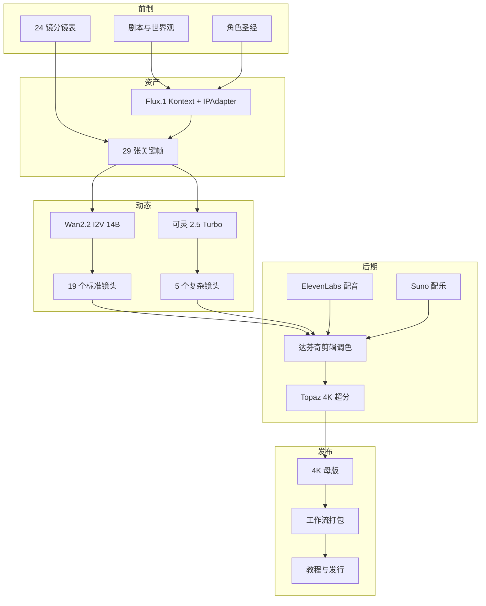

# ShotFlow

> 从一句剧本到 4K 母版，一条可复现的 AIGC 短片流水线。

[](./LICENSE)
[](https://www.python.org/downloads/)
[](./.github/workflows/ci.yml)
[](./03_Workflows/)
[](./docker-compose.yml)
[](https://ms33834.github.io/ShotFlow/)

[English](./README.md) | 中文 | [多语言文档索引](./docs/i18n/README.md)

ShotFlow 把 AIGC 短片制作从一堆零散的提示词，整理成一条可复现的流水线。示例片《奇点回响》走完每一站——剧本、角色圣经、29 张关键帧、24 个镜头、音频、调色、4K 母版——每一步的参数都被记录下来，任何一次成功的生成都能被复盘、复审、交接。

你可以整套拿走去做新片，也可以只抽一截——角色一致性方案、渲染队列、质检脚本——嵌进已经在做的项目里。

---

## 这个项目解决什么

AIGC 视频工具强大，但脆。一部短片每次都撞同一堵墙：

- 同一个角色换个镜头就变脸。
- 视频片段闪烁、扭曲、动作违反物理。
- 提示词和分镜对不上，剪到一半才发现缺镜头。
- 参数没记下来，下一次开跑就再也复现不出那一张。
- 文件被改名、覆盖、丢失，小团队协作一片混乱。

ShotFlow 把这些零散的线头串成一条管线，让结果可复现、让团队能协作。它是一套模板，不是产品——换上你自己的故事就能跑。

---

## 架构一览



完整链路与每个选型背后的理由，见 [`AIGC_Experience_Chain.zh.md`](./AIGC_Experience_Chain.zh.md)。

---

## 仓库镜像

| 平台 | 地址 |
|------|------|
| GitHub | https://github.com/MS33834/ShotFlow |
| GitCode | https://gitcode.com/badhope/ShotFlow |
| 项目站点 | https://ms33834.github.io/ShotFlow/ |

双仓库通过 [`08_Automation/sync_repos.sh`](./08_Automation/sync_repos.sh) 同步。

---

## 目录结构

```
ShotFlow/
├── 01_Assets/              # 角色/场景/音频资产
├── 02_Scripts/             # 剧本、分镜、提示词
├── 03_Workflows/           # ComfyUI JSON 工作流
├── 04_SOP/                 # 操作手册与制作规范
├── 05_Output/              # 输出成片
├── 06_Research/            # 技术栈、预算、授权、调优记录
├── 07_Team/                # 团队分工与 PM 模板
├── 08_Automation/          # 部署、生成、质检、同步脚本
├── 09_Release/             # 发布检查清单与展示模板
├── backend/                # Web 平台后端（FastAPI + SQLAlchemy + Celery）
├── frontend/               # Web 平台前端管理后台（React + Vite + Ant Design Pro）
├── examples/               # 示例与《奇点回响》完整案例
├── docs/                   # 教程、博客、多语言索引
├── tests/                  # 健康检查测试
├── .github/                # CI、Issue/PR 模板、CODEOWNERS、Dependabot
├── AIGC_Experience_Chain.md       # 端到端流水线选型说明
├── CHANGELOG.md
├── CODE_OF_CONDUCT.md
├── CONTRIBUTING.md
├── COST_ANALYSIS.md
├── Dockerfile
├── LICENSE
├── Makefile
├── README.md                      # English（主）
├── README.zh.md                   # 中文
├── SECURITY.md
├── TROUBLESHOOTING.md
├── docker-compose.yml
└── pyproject.toml
```

---

## 核心技术栈

| 环节 | 工具/模型 | 用途 |
|------|-----------|------|
| 剧本与角色 | DeepSeek / Claude | 剧本、世界观、角色圣经 |
| 角色一致性 | Flux.1 Kontext + IPAdapter | 角色参考图与关键帧，跨镜头不漂移 |
| 标准镜头视频 | Wan2.2 I2V 14B | 对白、特写的图生视频 |
| 复杂/转场镜头 | 可灵 2.5 Turbo | 首尾帧约束生成运动镜头 |
| 剪辑调色 | 达芬奇 Resolve | 精剪与青橙调色 |
| 配音 | ElevenLabs | 角色对白 |
| 配乐 | Suno / Udio | 氛围音乐 |
| 画质增强 | Topaz Video AI | 4K 超分与降噪 |
| 工作流平台 | ComfyUI | 节点化生成管线 |

---

## 快速开始

> 新手？看 [分步教程](./docs/tutorial.zh.md)（[English](./docs/tutorial.md)），从空仓库到 4K 母版，每步一条命令。

### 方式一：Docker（最快看一眼）

```bash
docker compose up -d
```

容器内已预装 Python 依赖与项目脚本，ComfyUI 与模型仍需按 [`08_Automation/deploy_comfyui.sh`](./08_Automation/deploy_comfyui.sh) 自行下载（受模型授权与体积限制，无法打包进镜像）。

### 方式二：本地源码

```bash
git clone https://github.com/MS33834/ShotFlow.git
cd ShotFlow

cp .env.example .env       # 填入 KLING_API_KEY、ELEVENLABS_API_KEY、SUNO_API_KEY 等
bash 08_Automation/deploy_comfyui.sh   # 需要 NVIDIA GPU，推荐 RTX 4090 24GB
make setup                 # 安装 Python 依赖（含 black、isort、pytest）
make check                 # 项目结构检查

python 08_Automation/preflight_check.py --dry-run     # 结构 + 密钥检查，无需 GPU
python 08_Automation/batch_keyframe_gen.py --dry-run  # 先预览，再去掉 --dry-run 实跑
python 08_Automation/storyboard_to_video.py --dry-run
```

生成脚本会调用 ComfyUI API 或云端 API，首次运行建议加 `--help` 或 `--dry-run`；`asset_dashboard.py` 和 `daily_brief.py` 默认会写入报告文件，可用 `--dry-run` 预览。

常用 `make` 命令：

```bash
make help     # 列出全部
make check    # 结构检查
make setup    # 安装依赖
make docker   # 启动全栈
make test     # 跑基础检查
make sync     # 同步双仓库
make clean    # 清理临时文件
```

---

## Web 平台

除了命令行工具集，ShotFlow 还提供一套 Web 平台，让非工程师也能在浏览器里驱动整条流水线。后端直接包装 `08_Automation` 脚本，不重写生成逻辑——同一套底层，两个入口。

```bash
docker compose up -d       # PostgreSQL + Redis + 后端 + Celery worker
# API 文档（Swagger）: http://localhost:8000/docs
# 健康检查:           http://localhost:8000/api/v1/health
```

`SIMULATE_MODE=true` 默认开启，所有 service 返回模拟结果，**无需 GPU 也能跑通全链路**。在 GPU 主机上设为 `false` 即接入真实 ComfyUI / 可灵 / ElevenLabs / Suno。

### 后端 API

| 路由 | 功能 |
|------|------|
| `/api/v1/auth` | 登录 / 当前用户 / 用户 CRUD（RBAC） |
| `/api/v1/projects` | 项目 CRUD |
| `/api/v1/shots` | 镜头与分镜管理 |
| `/api/v1/keyframes` | 关键帧管理 |
| `/api/v1/videos` | 视频片段管理 |
| `/api/v1/audio` | 对白与配音 |
| `/api/v1/queue` | 渲染队列：提交/查询/重试/取消 |
| `/api/v1/queue/stream/events` | SSE 实时队列状态推送 |
| `/api/v1/workflows` | ComfyUI 工作流管理 |
| `/api/v1/workflows-cfg` | YAML 工作流配置 + provider 评分 |
| `/api/v1/assets` | 资产画廊（按类型扫描磁盘） |
| `/api/v1/qa` | 质检报告 |
| `/api/v1/daily-briefs` | 每日站会简报 |
| `/api/v1/case-studies` | 公开案例展示 + 管理员 CRUD |
| `/api/v1/health` | 健康检查（DB + Redis） |

交互文档见 `/docs`（Swagger UI）与 `/redoc`。

### 前端管理后台

React 18 + TypeScript + Vite + Ant Design Pro。覆盖项目/镜头/关键帧/渲染队列/工作流/对白/质检全流程，渲染队列支持 SSE 实时状态推送。

```bash
cd frontend
npm install
npm run dev       # http://localhost:5173（代理到后端 8000）
npm run build
npm run typecheck
```

| 路由 | 功能 |
|------|------|
| `/login` | 登录页（JWT 认证） |
| `/dashboard` | 总览看板（健康检查 + 队列统计 + 项目概览） |
| `/projects` | 项目管理（CRUD） |
| `/shots` | 镜头管理（按项目过滤） |
| `/keyframes` | 关键帧管理（提交生成任务） |
| `/queue` | 渲染队列（SSE 实时状态 + 提交/重试/取消） |
| `/workflows` | ComfyUI 工作流管理 |
| `/workflow-configs` | 工作流 YAML 参数化配置 + Provider 评分 |
| `/assets` | 资产画廊（按类型扫描磁盘文件） |
| `/audio` | 对白配音管理 |
| `/qa` | 质检报告 |
| `/case-studies` | 用户案例展示区 |

SSE 推送用 `useQueueStream` hook 订阅，断线指数退避重连；前端 `types/index.ts` 与后端 `schemas` 对齐，端到端类型一致；Nginx 多阶段构建，SSE 代理禁用缓冲。

---

## 示例

- [`examples/character_prompts.md`](./examples/character_prompts.md)：艾娃角色一致性提示词
- [`examples/storyboard_sample.md`](./examples/storyboard_sample.md)：前 3 个镜头的简化分镜
- [`examples/comfyui_api_payload.json`](./examples/comfyui_api_payload.json)：调用 ComfyUI API 的载荷示例
- [`examples/env.example`](./examples/env.example)：环境变量最小配置
- [`examples/echo-of-singularity/`](./examples/echo-of-singularity/)：完整案例研究（双语）

---

## 完整作品

示例影片《奇点回响》不是几个零散的 demo 片段，而是一部**完整的 AIGC 短片作品**，从前制到发行每个环节的产物都在仓库里作为可参考的工程范例。

| 阶段 | 文件 | 内容 |
|------|------|------|
| 前制 | [`02_Scripts/`](./02_Scripts/) | 剧本、世界观、角色圣经、24 镜分镜、关键帧提示词 |
| 制作计划 | [`examples/echo-of-singularity/`](./examples/echo-of-singularity/) | 排期、制作日志、角色圣经、镜头追踪表 |
| 音频规划 | [`01_Assets/Audio/voice_bibles.md`](./01_Assets/Audio/voice_bibles.md) | 各角色 TTS 引擎、voice id、stability/style、情绪分段 |
| 音频规划 | [`01_Assets/Audio/cue_sheet.md`](./01_Assets/Audio/cue_sheet.md) | 全片对白/配乐/音效 cue sheet（入点出点 + 混音规则） |
| 音频规划 | [`01_Assets/Audio/sfx_list.md`](./01_Assets/Audio/sfx_list.md) | 每条音效的用途、来源（freesound CC0 / AudioLDM）、授权链 |
| 剪辑 | [`05_Output/EDL/shotflow_v01.edl`](./05_Output/EDL/shotflow_v01.edl) | EDL 时间线骨架 |
| 后期 | [`05_Output/Final/assembly_guide.md`](./05_Output/Final/assembly_guide.md) | 终剪装配指南——从 EDL + 素材到锁定母版（DaVinci Resolve） |
| 后期 | [`05_Output/Final/color_grading_notes.md`](./05_Output/Final/color_grading_notes.md) | 青橙调色配方、分镜节点图 |
| 后期 | [`05_Output/Final/final_mix_notes.md`](./05_Output/Final/final_mix_notes.md) | 混音目标、侧链避让规则、响度上限 |
| 后期 | [`05_Output/Final/upscale_and_repair_notes.md`](./05_Output/Final/upscale_and_repair_notes.md) | Topaz 4K 超分 + 瑕疵修复记录 |
| 资产清单 | [`05_Output/Final/asset_manifest.md`](./05_Output/Final/asset_manifest.md) | 完整资产清单（24 镜 / 10 对白 cue / 6 配乐 cue / 10 音效 / 29 关键帧）+ 校验和模板 |
| 字幕 | [`05_Output/Final/subtitles/`](./05_Output/Final/subtitles/) | `.srt`（中 + 英）+ 样式化 `.ass`（影院烧录用） |
| 片尾字幕 | [`05_Output/Final/credits.md`](./05_Output/Final/credits.md) | 演/职/工具/授权名单 |
| 交付规格 | [`05_Output/Final/delivery_specs.md`](./05_Output/Final/delivery_specs.md) | 各平台母版规格（4K / 1080p / 竖版 / 方版 / ProRes） |
| 发行 | [`09_Release/distribution_kit.md`](./09_Release/distribution_kit.md) | 各平台发行包：标题/简介/标签模板、AIGC 标识规则 |
| 发行 | [`09_Release/poster_spec.md`](./09_Release/poster_spec.md) | 各平台封面/海报规格：尺寸、色彩字体、Flux.1 提示词、排版流程 |
| 合规 | [`06_Research/licensing_compliance.md`](./06_Research/licensing_compliance.md) | 逐项工具授权审计、商用边界、商用升级预算 |

实际渲染出的视频文件（4K 母版、1080p 网络版、竖版、音频母版）**不**入库——文件大且部分使用 NC 许可的模型输出。上述文档是参考；按流水线跑完一遍生成实际素材，再按 `assembly_guide.md` 锁定母版。

---

## 硬件建议

| 组件 | 最低配置 | 推荐配置 |
|------|----------|----------|
| GPU | RTX 3090 24GB | RTX 4090 24GB |
| 内存 | 32GB | 64GB |
| 磁盘 | 200GB SSD | 1TB NVMe |
| 系统 | Ubuntu 22.04 | Ubuntu 22.04 / Windows 11 |

只有 CPU 或无本地 GPU？视频生成环节改用可灵 / Runway 等云端 API 即可。

---

## 参与贡献

欢迎提交 Issue 和 PR——补充 ComfyUI 工作流、改进提示词、修复脚本 Bug、补充后期经验、翻译文档，都有价值。具体规则见 [`CONTRIBUTING.zh.md`](./CONTRIBUTING.zh.md)（[English](./CONTRIBUTING.md)，含"每次提交前必查远程仓库状态"强制规范与每月开源项目体检清单），行为准则见 [`CODE_OF_CONDUCT.zh.md`](./CODE_OF_CONDUCT.zh.md)（[English](./CODE_OF_CONDUCT.md)）。

- 常见问题：[`TROUBLESHOOTING.zh.md`](./TROUBLESHOOTING.zh.md)
- 费用参考：[`COST_ANALYSIS.zh.md`](./COST_ANALYSIS.zh.md)
- 更新日志：[`CHANGELOG.md`](./CHANGELOG.md)
- 安全策略：[`SECURITY.zh.md`](./SECURITY.zh.md)（[English](./SECURITY.md)）
- 多语言文档：[`docs/i18n/README.md`](./docs/i18n/README.md)

## 致谢

站在下列开源项目的肩膀上：
- [ComfyUI](https://github.com/comfyanonymous/ComfyUI) — 节点化生成宿主
- [Flux.1](https://github.com/black-forest-labs/flux) — 图像模型
- [Wan2.2](https://github.com/Wan-Video/Wan2.2) — 视频模型
- [FastAPI](https://fastapi.tiangolo.com/)、[SQLAlchemy](https://www.sqlalchemy.org/)、[Celery](https://docs.celeryq.dev/)
- [React](https://react.dev/)、[Vite](https://vitejs.dev/)、[Ant Design](https://ant.design/)
- [DaVinci Resolve](https://www.blackmagicdesign.com/products/davinciresolve)、[Topaz Video AI](https://www.topazlabs.com/topaz-video-ai)

云端 API：ElevenLabs、Suno、可灵（PiAPI）。示例影片《奇点回响》是案例研究内容，与上述项目无隶属关系。

---

## 许可证

[MIT 开源协议](./LICENSE)

- 允许自由使用、复制、修改、合并、发布、分发、再授权和/或销售本软件的副本。

示例影片中的剧本、角色、镜头、对白、配乐均为案例研究内容，做自己的短片时请整体替换。
