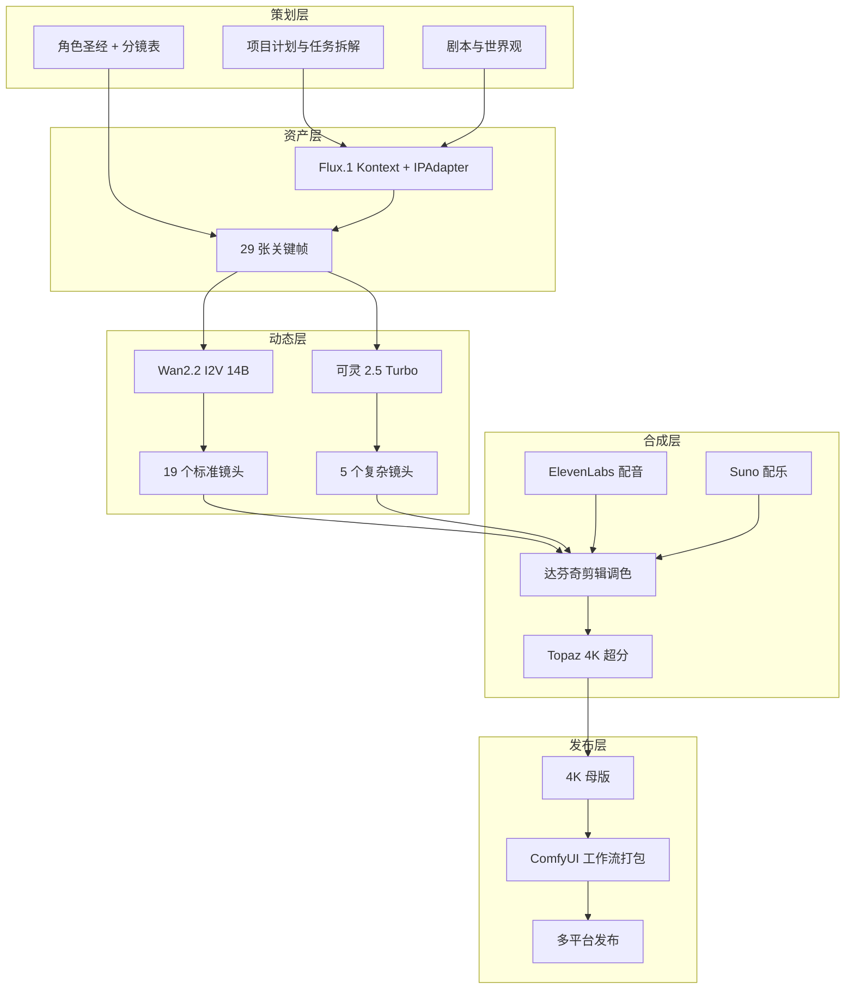

# ShotFlow — AIGC 全流程经验链

[English](./AIGC_Experience_Chain.md) | 中文

> 本文档说明 ShotFlow 覆盖的完整 AIGC 视频生产链路，以及每个环节想解决的具体问题。

---

## 为什么做这个项目

用 AI 做视频看起来很快，但真拉到 3–5 分钟的成片长度，问题会集中爆发：

- 同一张脸在第 3 镜和第 15 镜不像同一个人；
- 某个镜头人物手指多了一根，后面剪辑时才发现；
- 提示词改了几十版，没人记得哪一版是对的；
- 生成参数散落在各个 ComfyUI 节点里，换机器就要重调；
- 团队成员各自为政，最后合不到一起。

ShotFlow 就是把这些问题串成一条**可执行、可复现、可协作**的管线。我们用一个科幻短片《奇点回响》当示例，把从剧本到 4K 母版的每一步都写成文档、脚本和工作流，方便自己下次复用，也方便别人拿去改。

---

## 完整流程图

---

## 各阶段解决什么问题

### 第一阶段：资产铸造与技术验证

**要解决的问题**：角色跨镜头不一致。

**做法**：

- 用角色圣经固定外貌、服装、表情锚点；
- 用 IPAdapter 把多角度参考图绑定到 Flux 工作流；
- 生成关键帧后做盲测，不达标的镜头重跑。

**核心文件**：

- [`02_Scripts/script_and_worldbuilding.md`](./02_Scripts/script_and_worldbuilding.md)
- [`02_Scripts/keyframe_prompts.md`](./02_Scripts/keyframe_prompts.md)
- [`03_Workflows/Flux_Character_Consistency.json`](./03_Workflows/Flux_Character_Consistency.json)
- [`06_Research/qa_and_blind_test.md`](./06_Research/qa_and_blind_test.md)

---

### 第二阶段：动态镜头生产

**要解决的问题**：视频闪烁、崩坏、运动不符合分镜。

**做法**：

- 标准镜头走本地 Wan2.2 I2V，成本低、可控性强；
- 复杂镜头走可灵 2.5 Turbo 首尾帧，保证镜头衔接；
- Wan2.2 用 High Noise 专家负责大幅度运动，Low Noise 专家负责修复崩坏帧；
- 所有参数写入 CSV，方便复现和批量重跑。

**核心文件**：

- [`03_Workflows/Wan22_Dual_Expert_Video.json`](./03_Workflows/Wan22_Dual_Expert_Video.json)
- [`08_Automation/storyboard_to_video.py`](./08_Automation/storyboard_to_video.py)
- [`08_Automation/kling_video_api.py`](./08_Automation/kling_video_api.py)
- [`08_Automation/video_quality_check.py`](./08_Automation/video_quality_check.py)

---

### 第三阶段：后期合成与音效设计

**要解决的问题**：AI 素材看起来像散装片段，没有电影感。

**做法**：

- 粗剪确定叙事节奏，锁定剪辑后不再动结构；
- ElevenLabs 做角色配音，Suno 做氛围配乐；
- 达芬奇做 Teal & Orange 科幻调色；
- Topaz 做 4K 超分和降噪。

**核心文件**：

- [`04_SOP/postproduction.md`](./04_SOP/postproduction.md)
- [`04_SOP/audio_production.md`](./04_SOP/audio_production.md)
- [`08_Automation/elevenlabs_tts_api.py`](./08_Automation/elevenlabs_tts_api.py)
- [`08_Automation/suno_music_api.py`](./08_Automation/suno_music_api.py)

---

### 第四阶段：成片发布与工作流封装

**要解决的问题**：做完就散，下次从头再来。

**做法**：

- ComfyUI 工作流 JSON 打包归档；
- SOP 手册写入仓库；
- 发布检查清单保证交付物不遗漏；
- 教程模板和答辩 PPT 模板直接可用。

**核心文件**：

- [`08_Automation/package_workflows.sh`](./08_Automation/package_workflows.sh)
- [`09_Release/release_checklist.md`](./09_Release/release_checklist.md)
- [`09_Release/tutorial_template.md`](./09_Release/tutorial_template.md)
- [`09_Release/presentation_template.md`](./09_Release/presentation_template.md)

---

## 工程化能力

除了创意和生成，我们也把流程里的重复劳动脚本化了：

| 能力 | 对应文件 |
|------|----------|
| 一键部署 ComfyUI | [`08_Automation/deploy_comfyui.sh`](./08_Automation/deploy_comfyui.sh) |
| 环境预检 | [`08_Automation/preflight_check.py`](./08_Automation/preflight_check.py) |
| 性能基准测试 | [`08_Automation/benchmark.py`](./08_Automation/benchmark.py) |
| 批量关键帧生成 | [`08_Automation/batch_keyframe_gen.py`](./08_Automation/batch_keyframe_gen.py) |
| 批量视频生成 | [`08_Automation/storyboard_to_video.py`](./08_Automation/storyboard_to_video.py) |
| 渲染队列管理（已弃用） | [`08_Automation/render_queue.py`](./08_Automation/render_queue.py) — 已被 [`backend/app/services/queue_service.py`](./backend/app/services/queue_service.py) 取代 |
| 资产进度看板 | [`08_Automation/asset_dashboard.py`](./08_Automation/asset_dashboard.py) |
| 每日简报生成 | [`08_Automation/daily_brief.py`](./08_Automation/daily_brief.py) |
| 双仓库同步 | [`08_Automation/sync_repos.sh`](./08_Automation/sync_repos.sh) |

---

## 当前状态

| 类型 | 状态 | 说明 |
|------|------|------|
| 计划/文档/SOP | 完整 | 可直接套用 |
| ComfyUI 工作流 JSON | 完整 | Flux + Wan2.2 两个核心工作流 |
| 自动化脚本 | 完整 | 16 个脚本覆盖主要环节 |
| 剧本/分镜/提示词 | 完整 | 24 镜头 + 29 张关键帧提示词 |
| 角色参考图 PNG | 占位 | 脚本就绪，可在 GPU 环境生成 |
| 关键帧 PNG | 占位 | 同上 |
| 视频 MP4 | 占位 | 同上 |
| 音频素材 | 占位 | 同上 |
| 最终成片 | 占位 | 同上 |

> 这个仓库的核心价值是**流程、代码和文档**。实际 PNG/MP4 只是按脚本跑一遍的事，不影响流程本身的可用性。

---

## 推荐阅读路径

1. [`README.md`](./README.md) — 项目总览与快速开始
2. [`project_proposal.zh.md`](./07_Team/templates/project_proposal.zh.md) — 完整规划与技术架构
3. [`AIGC_Experience_Chain.md`](./AIGC_Experience_Chain.md) — 本文件，完整流程说明
4. [`04_SOP/sop_shotflow.md`](./04_SOP/sop_shotflow.md) — 全流程操作手册
5. [`08_Automation/README.md`](./08_Automation/README.md) — 自动化脚本说明
6. [`07_Team/expert_team.md`](./07_Team/expert_team.md) — 团队与角色分工
7. [`09_Release/presentation_template.md`](./09_Release/presentation_template.md) — 展示模板

---
